# LINQ Lab: Movie Reporting Application

## Overview
In this multi-part lab, students will build a console application called “Movie Report” that uses LINQ to process a collection of movies. Each part introduces new LINQ concepts and gradually increases the complexity of the application.

The basic structure of the application has already been created for you.  Your job will be to implement the querying and filtering methods that currently throw a `NotImplementedException`. 

All these labs use the `LinqLab.sln` solution

## A little bit about the application

This application is intended to be deployed (eventually) as a .NET Tool that can be run from the command line using the `movies` command. It's probably easiest to do your development and debugging work in Visual Studio rather than trying to run from the command prompt.  

If you want to install the app and try to run it from the command line, you can 

1. Open a powershell window
2. Go to the solution directory
3. Run `install.ps1`

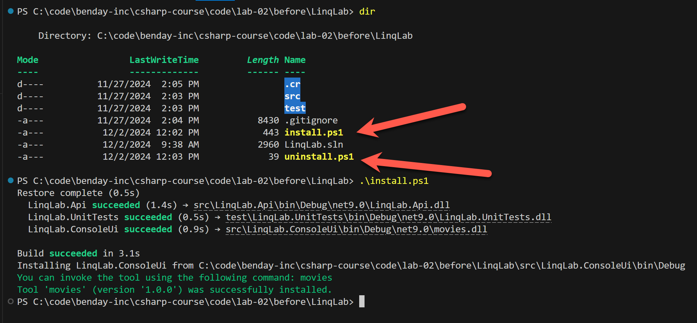

4. Once you've installed the application as a .NET Tool, you can run it by typing `movies`.  You should see the list of available commands in the tool -- **actor, genres, list, and popular**.  

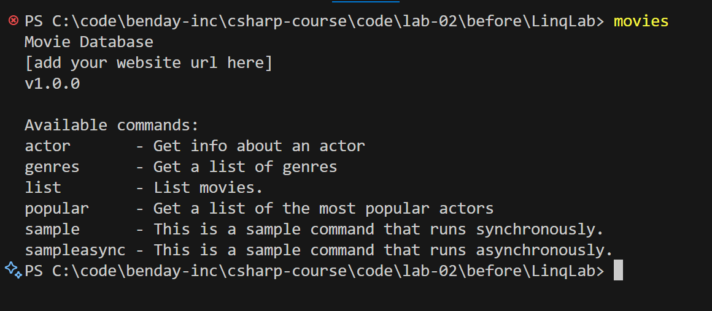

5. If you run the movies app with a command name and add the `--help` arg, you'll see the available arguments and options for that command.  For example if you run `movies list --help`, you should see a screen similar to the following.

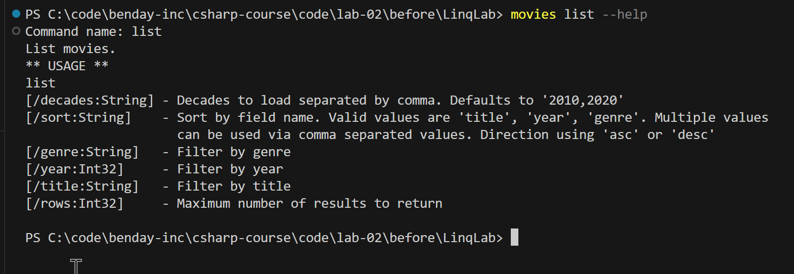

—

## Part 1: Basic LINQ Filtering and Sorting

For this lab you'll be working on the ListMoviesCommand implementation.

### Getting Started

1. Open **LinqLab.sln** in Visual Studio
2. In Solution Explorer, in the **LinqLab.Api** project you should see namespace folder called **Commands**. This is the folder where you'll be working.

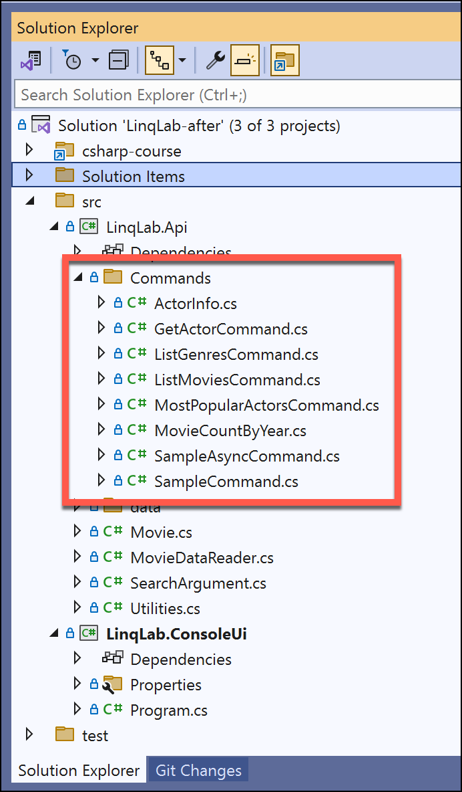

3. Open the **ListMoviesCommand.cs** file
4. In all of the *Command.cs classes, there will be be a method called **GetArguments()**. This method describes the values that are available on the command line.

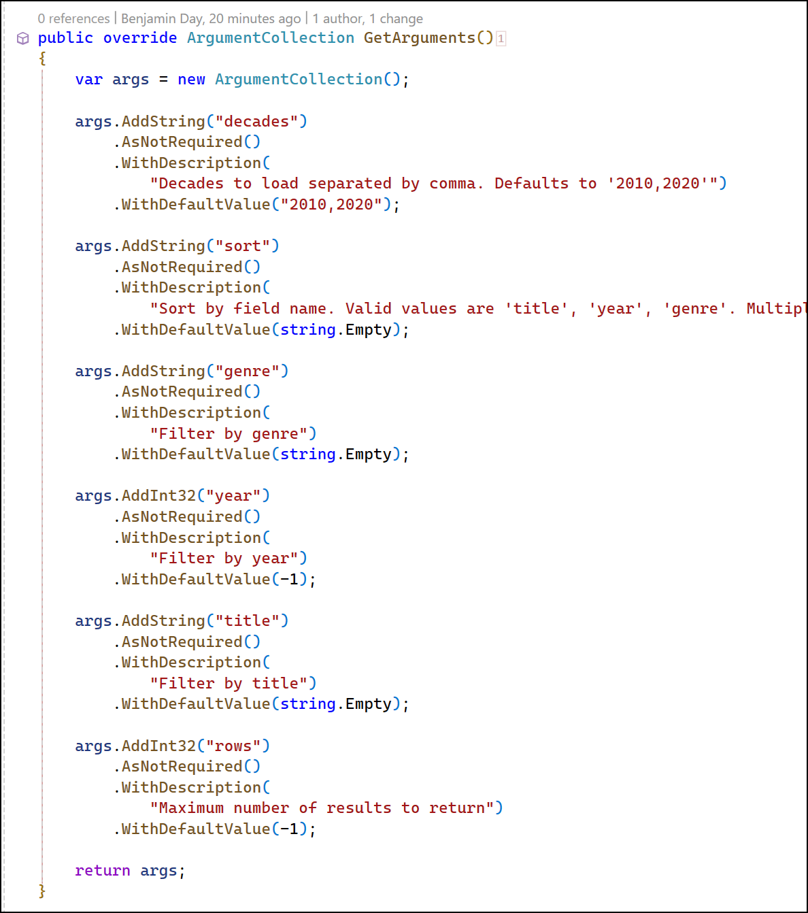

5. The **OnExecute()** method is where the work gets done for each command.

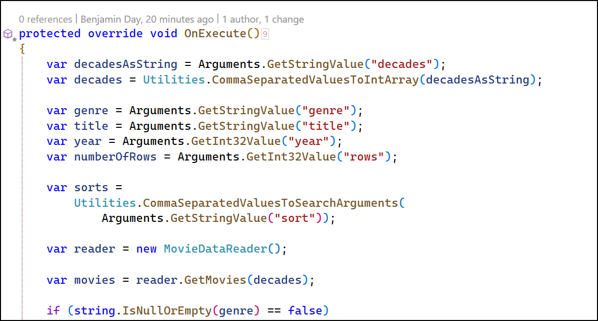

### Debugging the Application in Visual Studio

This application is a command line tool and thankfully Visual Studio has features that help us debug this kind of app.  We're going to be making use of **/Properties/launchSettings.json** to manage how to run our app.  

You can either edit **launchSettings.json** manually or using the Visual Studio **Debug Properties** editor.

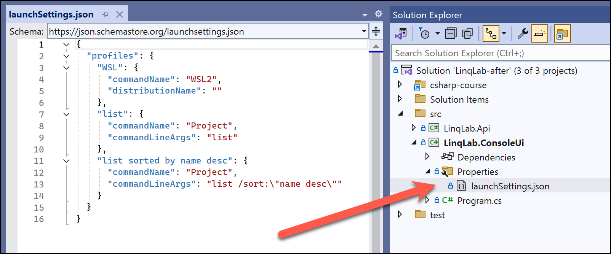

1. To access the **Debug Properties** editor, you click on the Debug button's drop down menu and then choose **Debug Properties**

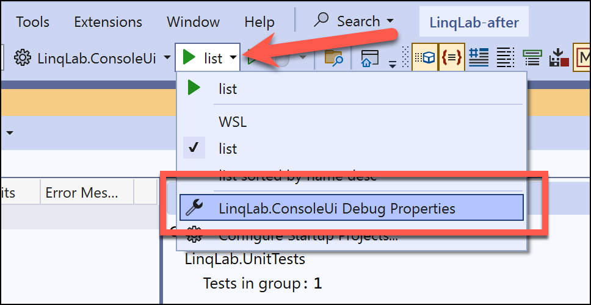

2. You should now see a window with the title **Launch Profiles**
3. On the left side, is a list of the launch profiles. In the image below (and in the sample solution), you should see two launch profiles: **list** and **list sorted by name desc**.  If you click on **list**, you'll see the command line arguments for this launch configuration 

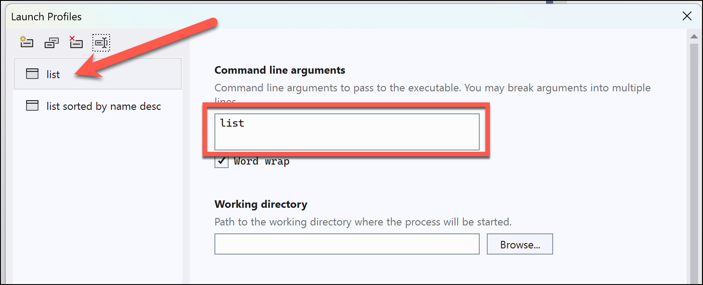

4. If you click on **list sorted by name desc**, you should see a completely different starting configuration for the list command that has arguments to sort by name in descending order. 

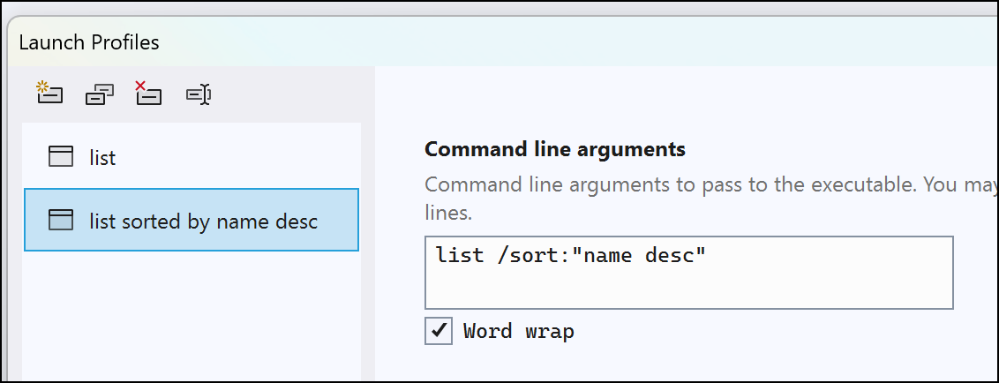

5. Close the **Launch Profiles** dialog
6. To choose which debug launch profile that you want to use, click on the debug dropdown menu and and choose the configuration you want to use.  In this case, choose **list**

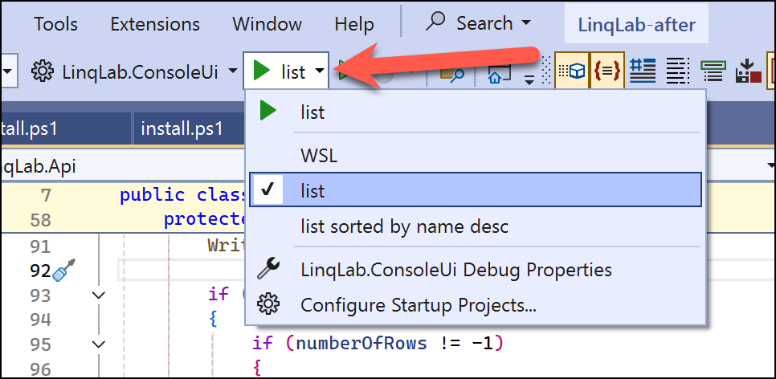

7. Click on **List** to start debugging

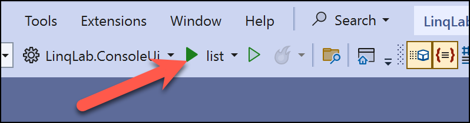

8. The app should run and you should see a list of movies

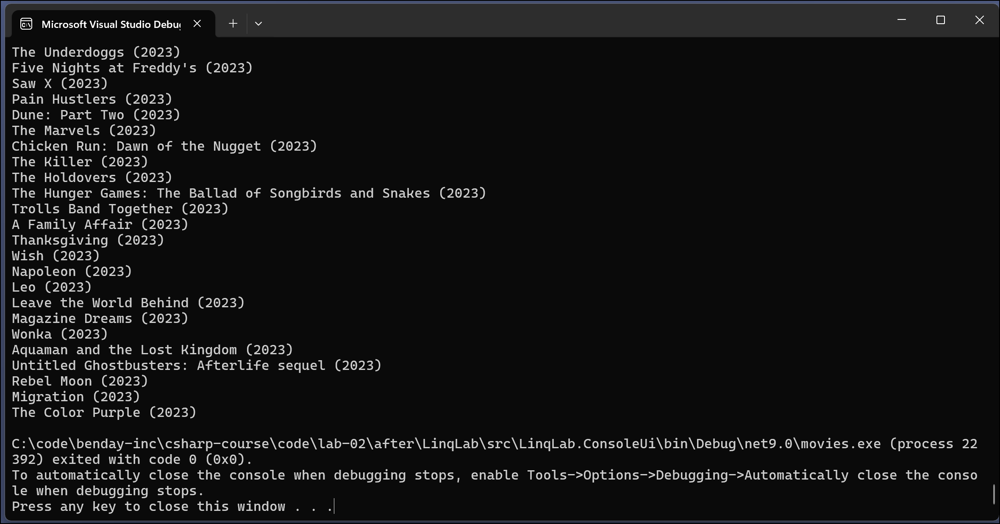

9. Press any key to stop debugging and close this window

### Implement Sorting using LINQ

You're now going to start implementing the missing features of the application.

1. Change the launch profile to be **list sorted by name desc**

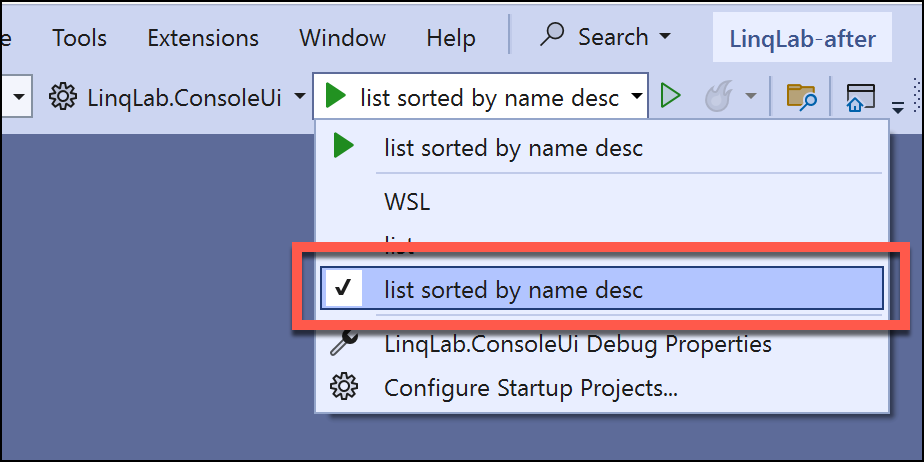

2. Run the app
3. The app should run and hit an exception in the **SortMovies()** method of **ListMoviesCommand.cs**.  

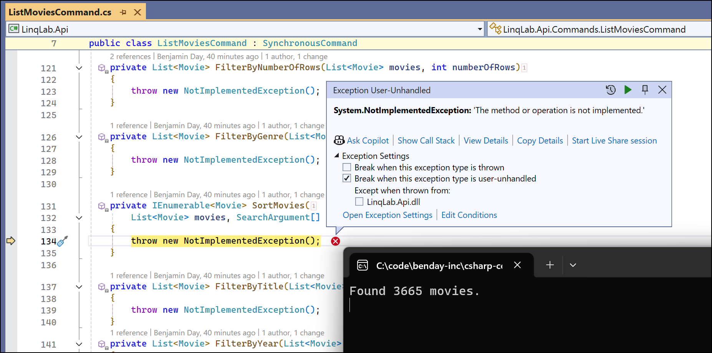

4. Press the stop button to end debugging

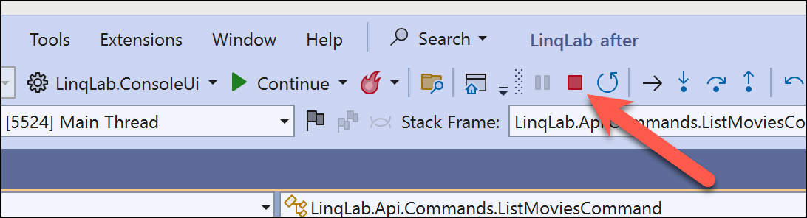

### Task: Implement SortMovies() for a single search argument

1. Go ahead and implement the SortMovies() method for a single argument.  In this case the single argument is **title desc**
2. Implement for by **title** ascending.  HINT: You'll probably want to add a new debug launch profile
3. Implement sort by **genre** and sort by **year** for both ascending and descending. HINT: you'll definitely want to start adding more debug launch profiles
4. Implement combination sorts
   *  Year descending and title ascending
   *  Year, title, genre
   *  Genre, title, year

### Task: Implement Filter by Number of Rows

This option will limit the number of rows that gets returned from the application.

1. Implement the **FilterByNumberOfRows()** method

### Task: Filter by Year

This will filter the movie results by year

1. Implement the **FilterByYear()** method

### Task: Filter by Genre

This will filter by movie genre.  

1. Implement the **FilterByGenre()** method

### Task: Filter by Title

This will filter by movie title

1. Implement the **FilterByTitle()** method

### Task (Optional): Filter by Actor

This one is a little harder because I haven't created the structure for you.  

1. Add a new argument definition for actor name
2. Get the actor name filter value in the OnExecute() method
3. Implement a filter method for finding movies with a given actor

## List Genres

In this section of the lab, you'll be working on the **ListGenresCommand**.  The purpose of this command is to find all the genres in the database and display them sorted by name either ascending or descending.  The trick here is going to be making sure that you return only distinct values -- NO DUPLICATES ALLOWED!

1. Open **ListGenresCommand.cs**
2. Implement the **GetDistinctGenres()** method

HINT: you should add at least one new debug launch configuration.

## Most Popular Actors

In this lab, we're trying to answer the question -- **Which actors and actresses are the most popular?**  To do this, you're going to need to figure out 

* All the actor names in the dataset
* How many movies each actor was in
* Find the actors with the most movies

1. Open **MostPopularActorsCommand.cs**
2. Implement the **GetMostPopularActors()** method

## Actor Report

This method is for creating a report on what an actor has been up to.  The things we're looking for:

* Actor Name
* Most common co-stars
* Most common genres
* Number of movies per year

1. Open **GetActorCommand.cs**
2. Implement all the methods that currently throw **NotImplementedException**

