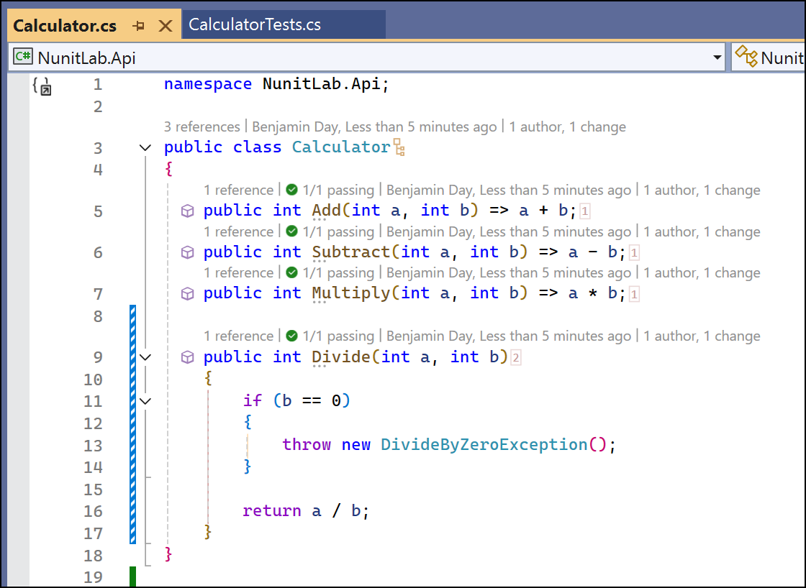
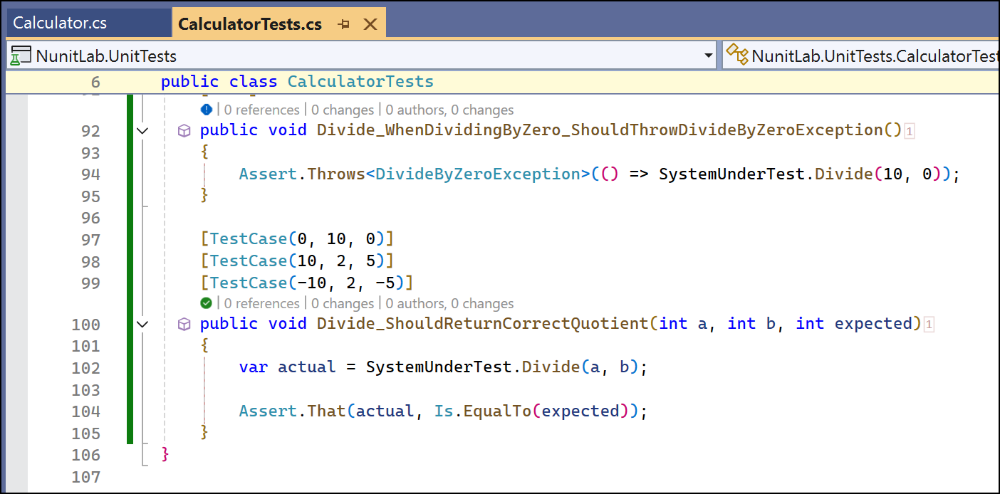
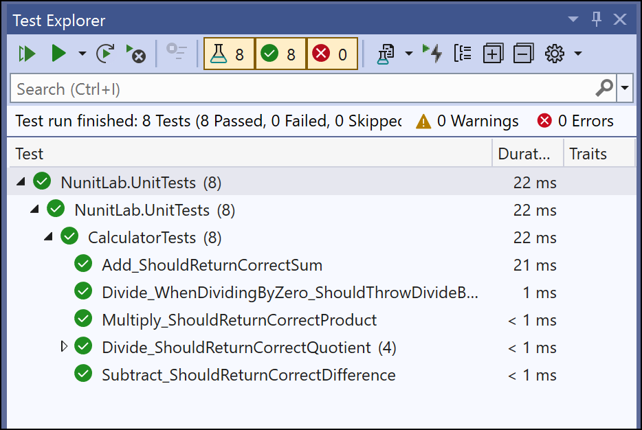

# Lab 2: Testing Edge Cases and Exceptions

## Objective
Learn how to test edge cases and handle exceptions using NUnit.

## Prerequisites
- Completion of **Lab 1** or familiarity with basic NUnit tests.

## Instructions

### Step 1: Extend the Calculator Class
1. Open the `Calculator.cs` file in the `NunitLab` project.
2. Modify the `Divide` method to handle division by zero:
   ```csharp
   public int Divide(int a, int b)
   {
       if (b == 0) throw new DivideByZeroException("Cannot divide by zero.");
       return a / b;
   }
   ```



### Step 2: Write Tests for Edge Cases
1. Open the `CalculatorTests.cs` file in the `NunitLab.UnitTests` project.
2. Add the following tests to handle edge cases:
   ```csharp
   [Test]
   public void Divide_WhenDividingByZero_ShouldThrowDivideByZeroException()
   {
       Assert.Throws<DivideByZeroException>(() => SystemUnderTest.Divide(10, 0));
   }
   
   [TestCase(0, 10, 0)]
   [TestCase(10, 2, 5)]
   [TestCase(-10, 2, -5)]
   public void Divide_ShouldReturnCorrectQuotient(int a, int b, int expected)
   {
       var actual = SystemUnderTest.Divide(a, b);
       Assert.That(actual, Is.EqualTo(expected));
   }
   ```



### Step 3: Run the Tests
1. Open the **Test Explorer** in Visual Studio.
2. Run all tests and verify that:
   - The division by zero test throws the correct exception.
   - The parameterized tests for valid input pass successfully.



## Outcome
Students will:
- Understand how to write tests for exceptions using `Assert.Throws`.
- Use parameterized tests (`[TestCase]`) to validate multiple input-output scenarios.

---
