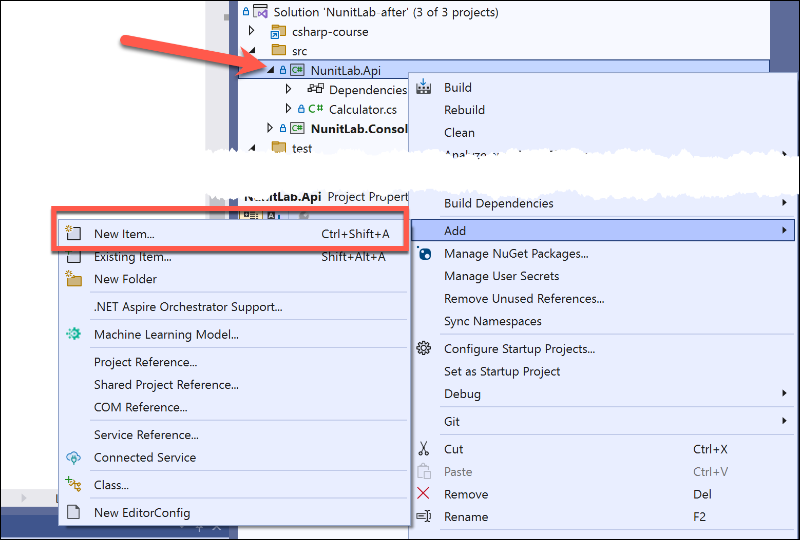
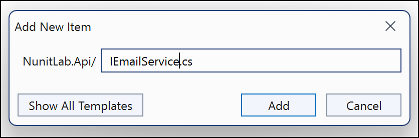
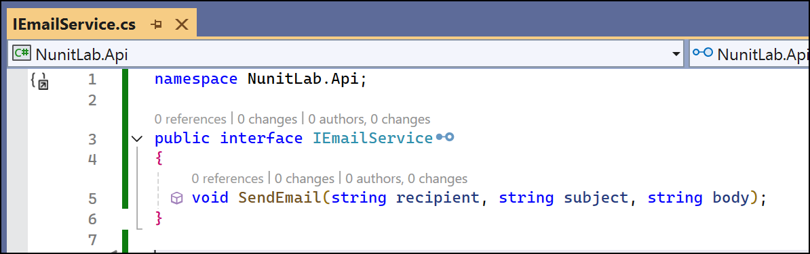
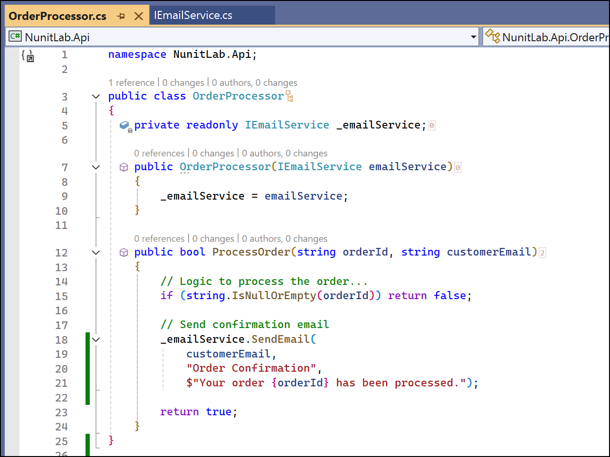
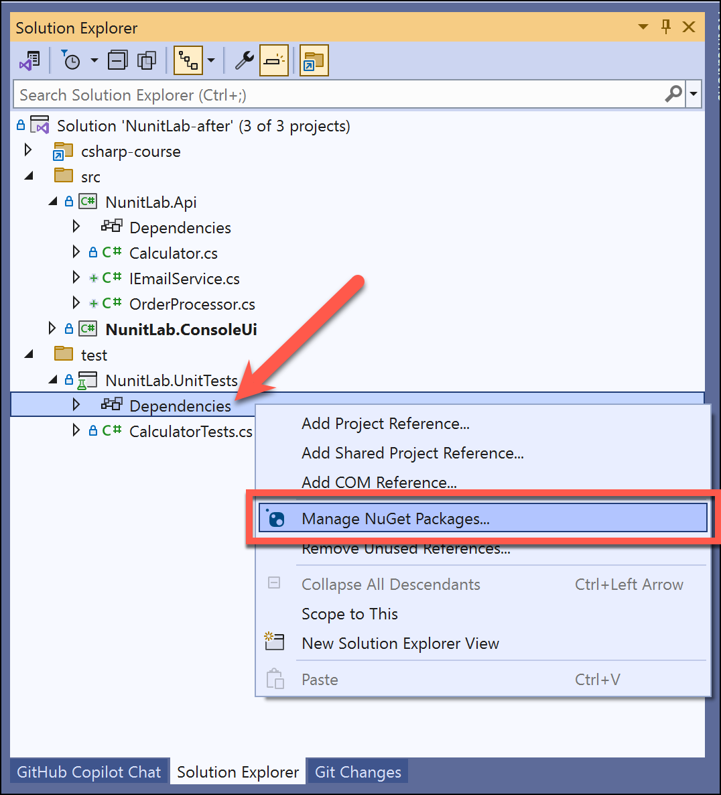
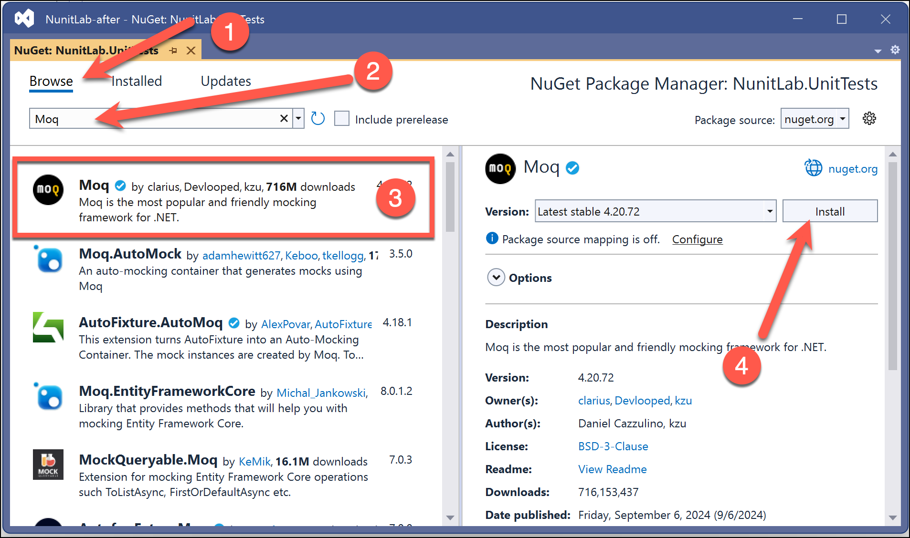
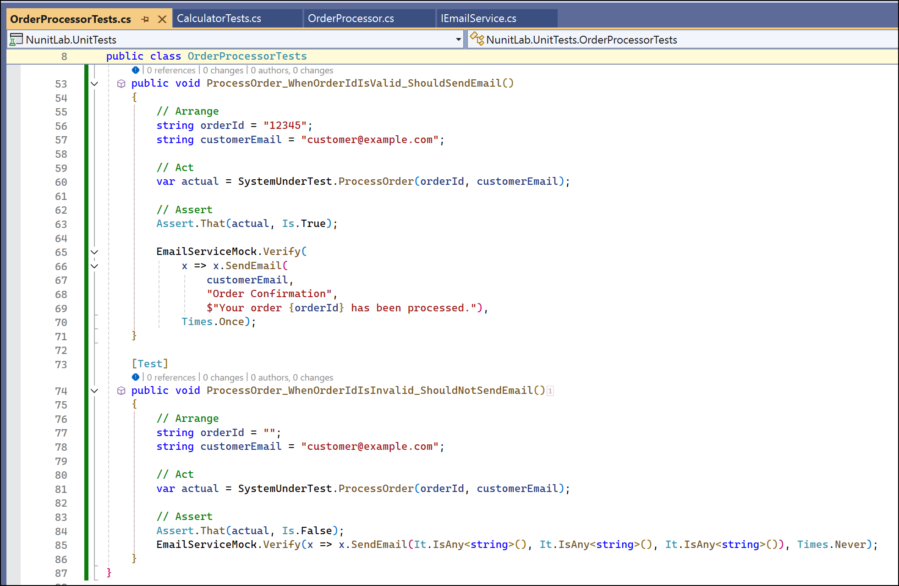
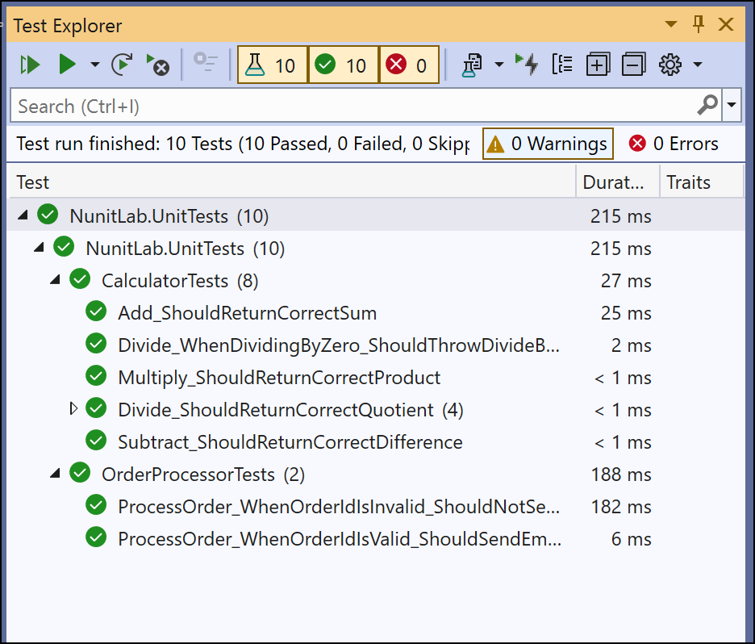

# Lab 3: Testing Classes with Dependencies

## Objective
Learn how to test classes that depend on other services by using mocking frameworks.

## Prerequisites
- Completion of **Lab 2** or familiarity with basic NUnit tests and exception handling.
- NuGet package for Moq installed in the `NunitLab.UnitTests` project.

## Instructions

### Step 1: Create the `IEmailService` and `OrderProcessor` Classes
1. In the `NunitLab.Api` project, create a new interface `IEmailService.cs`. To do this, right-click on the **Nunit.API** project in **Solution Explorer**, go to **Add > New Item...** 



2.  You should now see the **Add New Item** dialog.  Type **IEmailService.cs** in the box and click the **Add** button



3. You should now see the new interface file &dash; **IEmailService.cs**
4. Modify **IEmailService** to look like the code below:

   ```csharp
   namespace NunitLab.Api;
   
   public interface IEmailService
   {
       void SendEmail(string recipient, string subject, string body);
   }
   ```



5. Create a new class `OrderProcessor.cs` that uses `IEmailService`:
   ```csharp
   namespace NunitLab.Api;
   
   public class OrderProcessor
   {
       private readonly IEmailService _emailService;
   
       public OrderProcessor(IEmailService emailService)
       {
           _emailService = emailService;
       }
   
       public bool ProcessOrder(string orderId, string customerEmail)
       {
           // Logic to process the order...
           if (string.IsNullOrEmpty(orderId)) return false;
   
           // Send confirmation email
           _emailService.SendEmail(customerEmail, "Order Confirmation", $"Your order {orderId} has been processed.");
           return true;
       }
   }
   ```



### Step 2: Add Tests for `OrderProcessor`
1. In the `NunitLab.UnitTests` project, install the Moq NuGet package:
   - Expand the project so that you can see the **Dependencies** node
   - Right-click on the **Dependencies** node, choose **Manage NuGet Packages**

   
   
   - Select the **Browse** tab
   - Type **moq** in the search box
   - Select **Moq** from the results
   - Click the **Install** button to install Moq package into the unit test project
   
   
   
2. Create a new test class `OrderProcessorTests.cs`:
   ```csharp
   using Moq;
   using NunitLab.Api;
   
   namespace NunitLab.UnitTests;
   
   [TestFixture]
   public class OrderProcessorTests
   {
   
       private OrderProcessor? _systemUnderTest;
       private Mock<IEmailService>? _emailServiceMock;
   
       public OrderProcessor SystemUnderTest
       {
           get
           {
               if (_systemUnderTest == null)
               {
                   _systemUnderTest = new OrderProcessor(EmailServiceMock.Object);
               }
   
               Assert.That(_systemUnderTest, Is.Not.Null);
               Assert.That(_emailServiceMock, Is.Not.Null);
   
               return _systemUnderTest;
           }
       }
   
       public Mock<IEmailService> EmailServiceMock
       {
           get
           {
               if (_emailServiceMock == null)
               {
                   _emailServiceMock = new Mock<IEmailService>();
               }
   
               Assert.That(_emailServiceMock, Is.Not.Null);
   
               return _emailServiceMock;
           }
       }
   
       [SetUp]
       public void SetUp()
       {
           _systemUnderTest = null;
           _emailServiceMock = null;
       }
   
       [Test]
       public void ProcessOrder_WhenOrderIdIsValid_ShouldSendEmail()
       {
           // Arrange
           string orderId = "12345";
           string customerEmail = "customer@example.com";
   
           // Act
           var actual = SystemUnderTest.ProcessOrder(orderId, customerEmail);
   
           // Assert
           Assert.That(actual, Is.True);
   
           EmailServiceMock.Verify(
               x => x.SendEmail(
                   customerEmail, 
                   "Order Confirmation", 
                   $"Your order {orderId} has been processed."),
               Times.Once);
       }
   
       [Test]
       public void ProcessOrder_WhenOrderIdIsInvalid_ShouldNotSendEmail()
       {
           // Arrange
           string orderId = "";
           string customerEmail = "customer@example.com";
   
           // Act
           var actual = SystemUnderTest.ProcessOrder(orderId, customerEmail);
   
           // Assert
           Assert.That(actual, Is.False);
           EmailServiceMock.Verify(x => x.SendEmail(It.IsAny<string>(), It.IsAny<string>(), It.IsAny<string>()), Times.Never);
       }
   }
   ```



### Step 3: Run and Verify Tests
1. Open the **Test Explorer** in Visual Studio.
2. Run all tests and verify that:
   - The email is sent only when the order ID is valid.
   - No email is sent for invalid order IDs.




---
