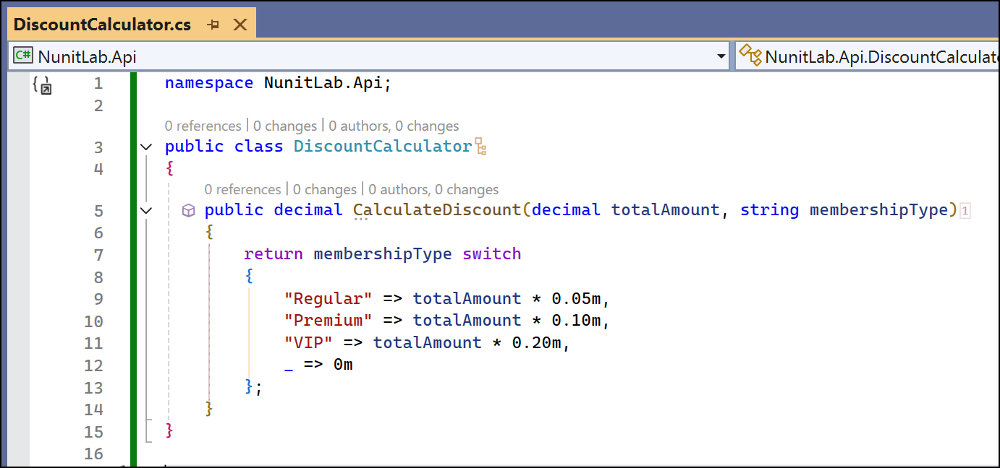
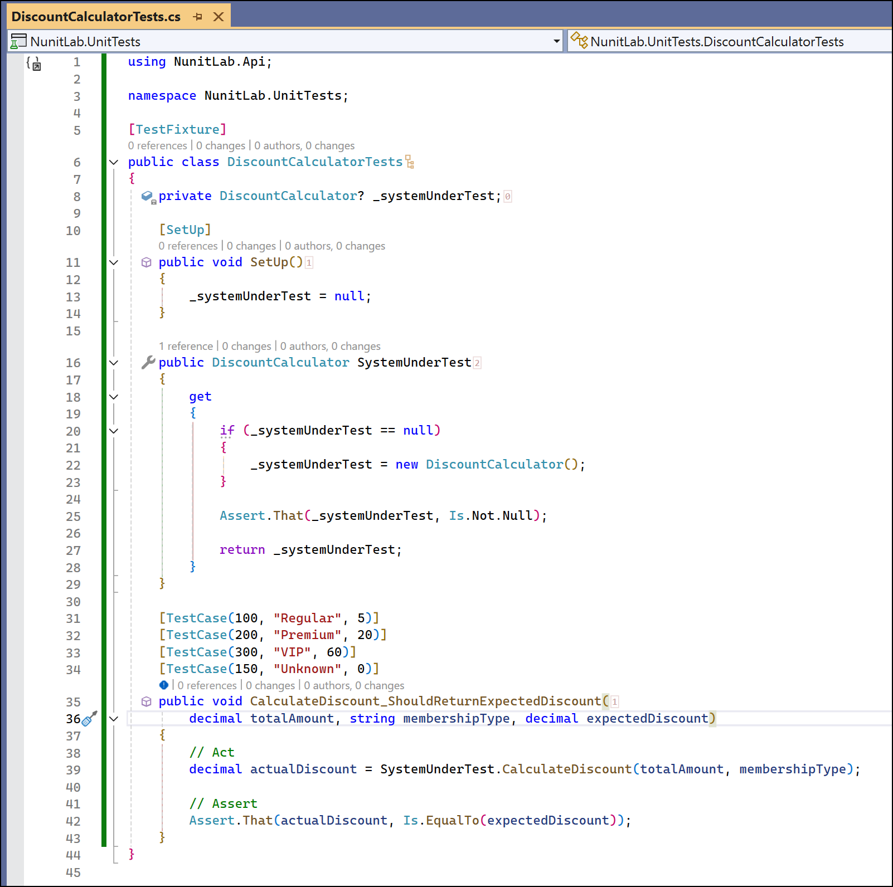
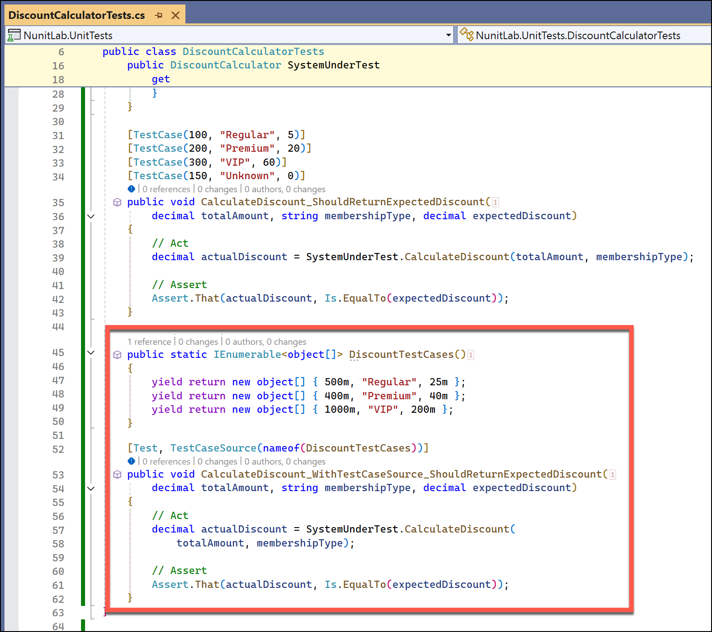
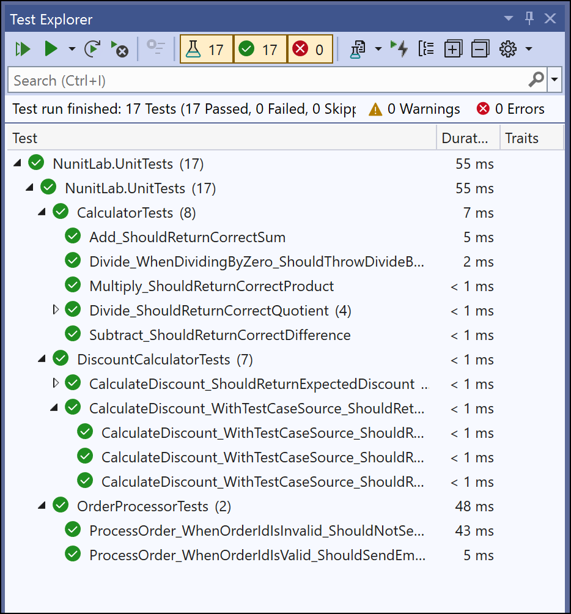

# Lab 4: Parameterized and Data-Driven Tests

## Objective
Learn how to use NUnit’s parameterized and data-driven test features to test multiple scenarios efficiently.

## Prerequisites
- Completion of **Lab 3** or familiarity with mocking and dependency isolation.
- Basic understanding of NUnit test attributes like `[Test]`.

## Instructions

### Step 1: Add a Discount Calculator Class
1. In the `NunitLab.Api` project, create a new class `DiscountCalculator.cs`:
   ```csharp
   namespace NunitLab.Api;
   
   public class DiscountCalculator
   {
       public decimal CalculateDiscount(decimal totalAmount, string membershipType)
       {
           return membershipType switch
           {
               "Regular" => totalAmount * 0.05m,
               "Premium" => totalAmount * 0.10m,
               "VIP" => totalAmount * 0.20m,
               _ => 0m
           };
       }
   }
   ```



### Step 2: Write Parameterized Tests
1. In the `NunitLab.UnitTests` project, create a new test class `DiscountCalculatorTests.cs`:
   ```csharp
   using NunitLab.Api;
   
   namespace NunitLab.UnitTests;
   
   [TestFixture]
   public class DiscountCalculatorTests
   {
       private DiscountCalculator? _systemUnderTest;
   
       [SetUp]
       public void SetUp()
       {
           _systemUnderTest = null;
       }
   
       public DiscountCalculator SystemUnderTest
       {
           get
           {
               if (_systemUnderTest == null)
               {
                   _systemUnderTest = new DiscountCalculator();
               }
   
               Assert.That(_systemUnderTest, Is.Not.Null);
   
               return _systemUnderTest;
           }
       }
   
       [TestCase(100, "Regular", 5)]
       [TestCase(200, "Premium", 20)]
       [TestCase(300, "VIP", 60)]
       [TestCase(150, "Unknown", 0)]
       public void CalculateDiscount_ShouldReturnExpectedDiscount(
           decimal totalAmount, string membershipType, decimal expectedDiscount)
       {
           // Act
           decimal actualDiscount = SystemUnderTest.CalculateDiscount(totalAmount, membershipType);
   
           // Assert
           Assert.That(actualDiscount, Is.EqualTo(expectedDiscount));
       }
   }
   ```



### Step 3: Use `[TestCaseSource]` for Complex Data Sets
1. In **DiscountCalculatorTests.cs**, add a method to supply test data:
   ```csharp
   public static IEnumerable<object[]> DiscountTestCases()
   {
       yield return new object[] { 500m, "Regular", 25m };
       yield return new object[] { 400m, "Premium", 40m };
       yield return new object[] { 1000m, "VIP", 200m };
   }
   ```

2. Use `[TestCaseSource]` to reference the data source:
   ```csharp
   [Test, TestCaseSource(nameof(DiscountTestCases))]
   public void CalculateDiscount_WithTestCaseSource_ShouldReturnExpectedDiscount(
       decimal totalAmount, string membershipType, decimal expectedDiscount)
   {
       // Act
       decimal actualDiscount = SystemUnderTest.CalculateDiscount(
           totalAmount, membershipType);
   
       // Assert
       Assert.That(actualDiscount, Is.EqualTo(expectedDiscount));
   }
   ```



### Step 4: Run the Tests
1. Open the **Test Explorer** in Visual Studio.
2. Run all tests and verify that:
   - All parameterized test cases pass.
   - Tests using `[TestCaseSource]` execute as expected.



## Outcome
Students will:
- Understand how to use `[TestCase]` for parameterized tests.
- Leverage `[TestCaseSource]` for complex or dynamically generated test data.

---
