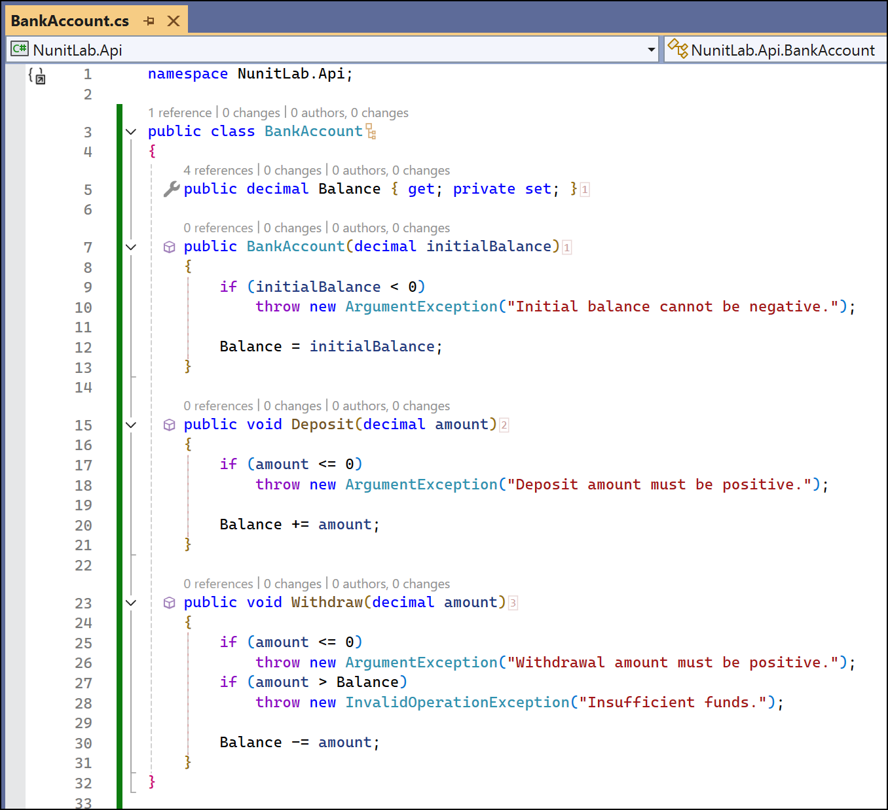
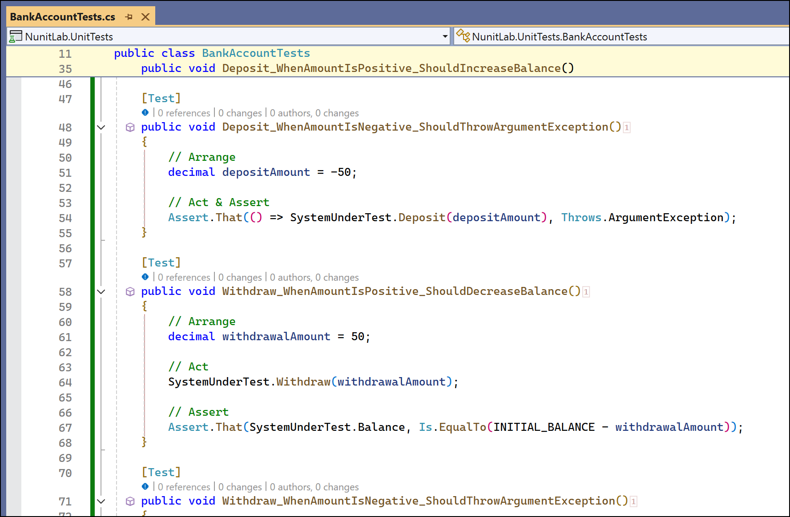
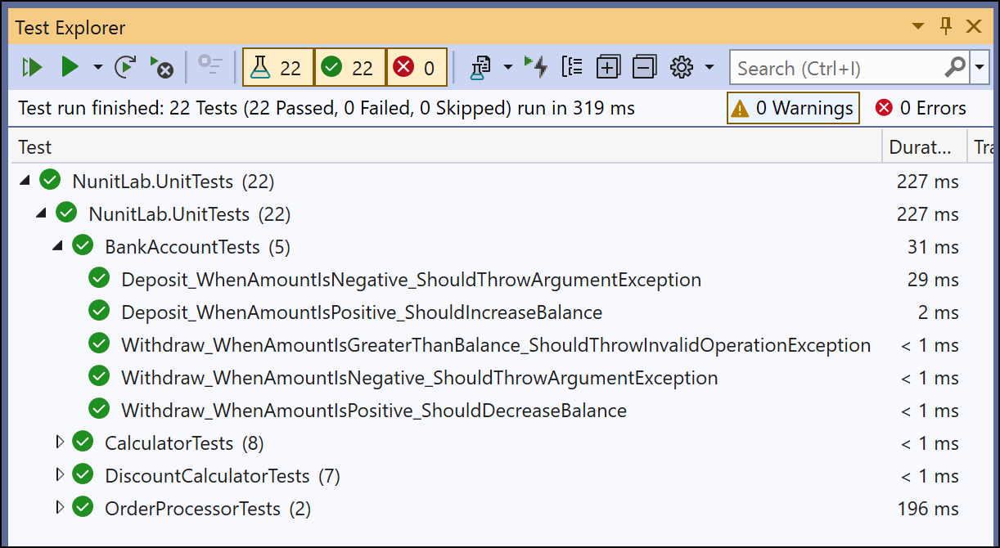
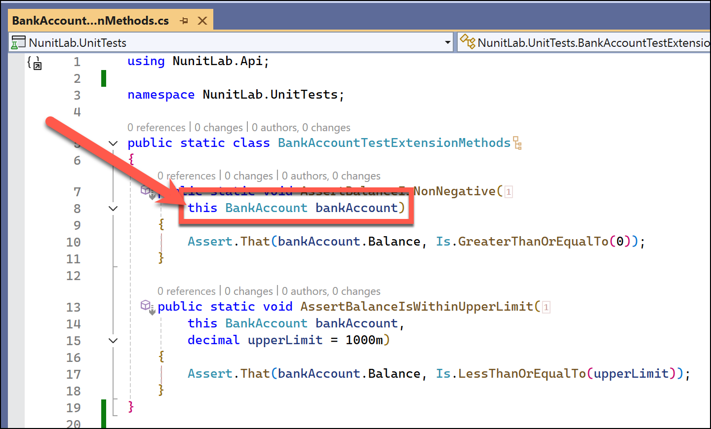
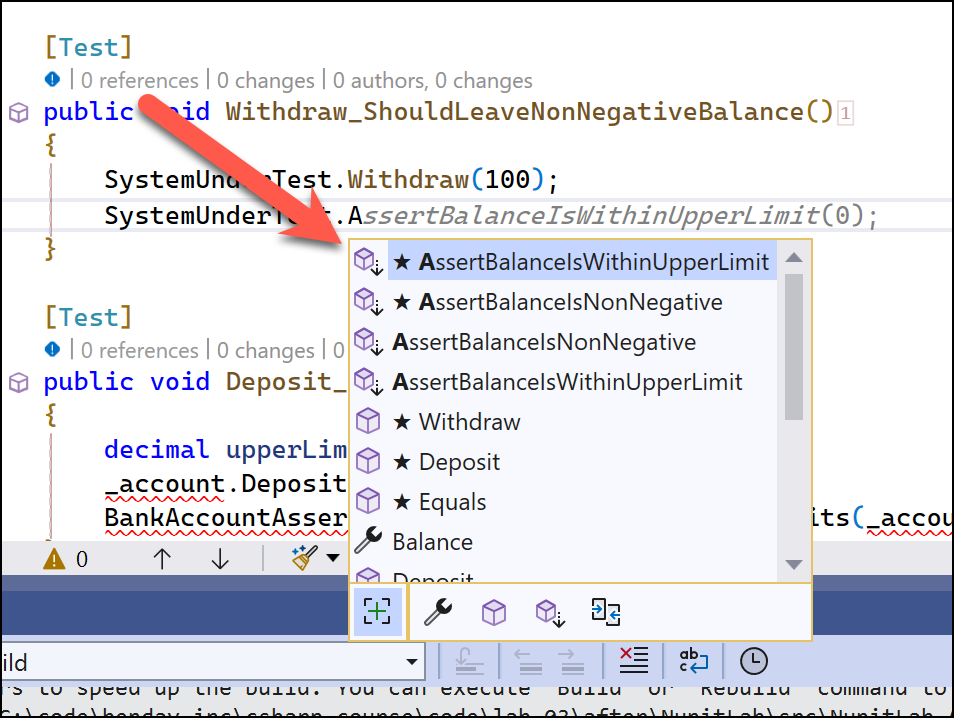
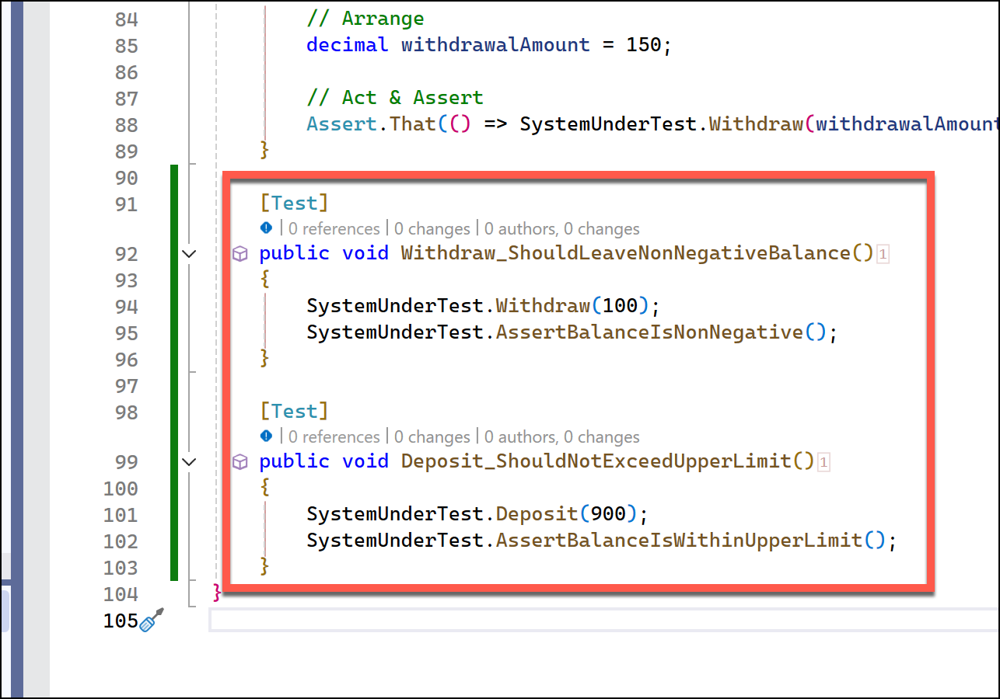
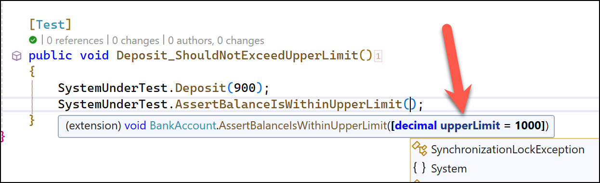
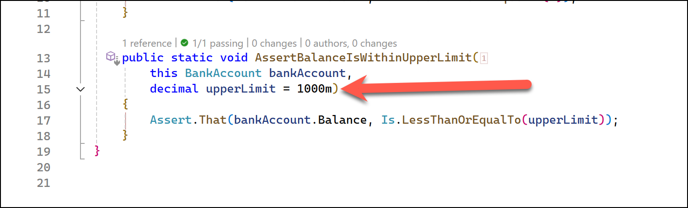
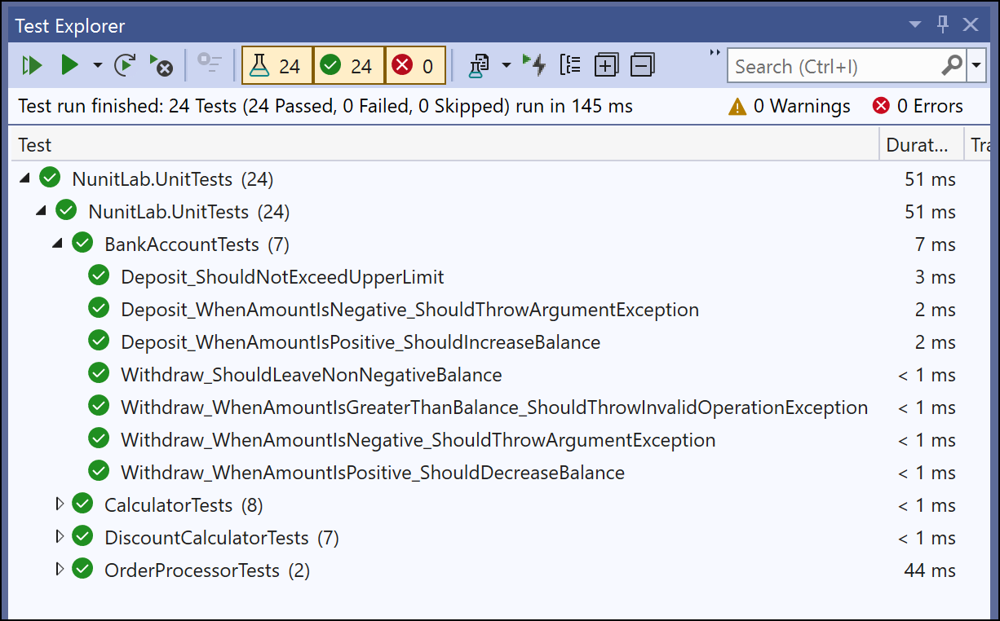

# Lab 5: Writing Custom Assertions

## Objective
Learn how to create and use custom assertions to improve test clarity and reuse.

## Prerequisites
- Completion of **Lab 4** or familiarity with parameterized tests.
- Basic understanding of NUnit and assertions.

## Instructions

### Step 1: Create the BankAccount Class
1. In the `NunitLab.Api` project, create a new class `BankAccount.cs`:
   ```csharp
   namespace NunitLab.Api;
   
   public class BankAccount
   {
       public decimal Balance { get; private set; }
   
       public BankAccount(decimal initialBalance)
       {
           if (initialBalance < 0)
               throw new ArgumentException("Initial balance cannot be negative.");
   
           Balance = initialBalance;
       }
   
       public void Deposit(decimal amount)
       {
           if (amount <= 0)
               throw new ArgumentException("Deposit amount must be positive.");
   
           Balance += amount;
       }
   
       public void Withdraw(decimal amount)
       {
           if (amount <= 0)
               throw new ArgumentException("Withdrawal amount must be positive.");
           if (amount > Balance)
               throw new InvalidOperationException("Insufficient funds.");
   
           Balance -= amount;
       }
   }
   ```



### Step 2: Add Tests for BankAccount
1. In the `NunitLab.UnitTests` project, create a new test class `BankAccountTests.cs`:
   ```csharp
   using NunitLab.Api;
   using System;
   using System.Collections.Generic;
   using System.Linq;
   using System.Text;
   using System.Threading.Tasks;
   
   namespace NunitLab.UnitTests;
   
   [TestFixture]
   public class BankAccountTests
   {
       private const decimal INITIAL_BALANCE = 100;
       private BankAccount? _systemUnderTest;
       public BankAccount SystemUnderTest
       {
           get
           {
               if (_systemUnderTest == null)
               {
                   _systemUnderTest = new BankAccount(INITIAL_BALANCE);
               }
               Assert.That(_systemUnderTest, Is.Not.Null);
               return _systemUnderTest;
           }
       }
   
       [SetUp]
       public void SetUp()
       {
           _systemUnderTest = null;
       }
   
       [Test]
       public void Deposit_WhenAmountIsPositive_ShouldIncreaseBalance()
       {
           // Arrange
           decimal depositAmount = 50;
   
           // Act
           SystemUnderTest.Deposit(depositAmount);
   
           // Assert
           Assert.That(SystemUnderTest.Balance, Is.EqualTo(INITIAL_BALANCE + depositAmount));
       }
   
       [Test]
       public void Deposit_WhenAmountIsNegative_ShouldThrowArgumentException()
       {
           // Arrange
           decimal depositAmount = -50;
           
           // Act & Assert
           Assert.That(() => SystemUnderTest.Deposit(depositAmount), Throws.ArgumentException);
       }
   
       [Test]
       public void Withdraw_WhenAmountIsPositive_ShouldDecreaseBalance()
       {
           // Arrange
           decimal withdrawalAmount = 50;
           
           // Act
           SystemUnderTest.Withdraw(withdrawalAmount);
   
           // Assert
           Assert.That(SystemUnderTest.Balance, Is.EqualTo(INITIAL_BALANCE - withdrawalAmount));
       }
   
       [Test]
       public void Withdraw_WhenAmountIsNegative_ShouldThrowArgumentException()
       {
           // Arrange        
           decimal withdrawalAmount = -50;
           
           // Act & Assert
           Assert.That(() => SystemUnderTest.Withdraw(withdrawalAmount), Throws.ArgumentException);
       }
   
       [Test]
       public void Withdraw_WhenAmountIsGreaterThanBalance_ShouldThrowInvalidOperationException()
       {
           // Arrange
           decimal withdrawalAmount = 150;
           
           // Act & Assert
           Assert.That(() => SystemUnderTest.Withdraw(withdrawalAmount), Throws.InvalidOperationException);
       }
   }
   ```



### Step 3: Run the Tests

* Run the tests using **Test Explorer**
* The tests should pass



### Step 4: Refactor to use Custom Assertions & C# Extension Methods

So far our test code and our application code is manageable. There just aren't that many lines of code and nothing is too complex.  The business logic is simple and straightforward.  In a real life application, the app code can become huge and the test code can become a beast in its own right. 

For readability and for maintainability, we'll frequently want to "method-ize" our test code so that we don't end up with a whole bunch of duplicated functionality and logic.  

In this part of the lab, we're going to use C# Extension Methods to create some utility methods for asserting the state of our bank account balance.  Specifically: 1) checking for negative balance and 2) checking for a balance that's too high.  

1. Create a helper class `BankAccountTestExtensionMethods.cs` in the `NunitLab.UnitTests` project.

2. The starting class will probably look something like the following code.  

Nothing special.  Just a plain old C# class.  

```csharp
namespace NunitLab.UnitTests;

internal class BankAccountTestExtensionMethods
{
    
}
```

Extension methods need to be `static` and declared in a `static class`.  

3. Modify the code so that it matches the code below:

   ```csharp
   using NunitLab.Api;
   
   namespace NunitLab.UnitTests;
   
   public static class BankAccountTestExtensionMethods
   {
       public static void AssertBalanceIsNonNegative(
           this BankAccount bankAccount)
       {
           Assert.That(bankAccount.Balance, Is.GreaterThanOrEqualTo(0));
       }
   
       public static void AssertBalanceIsWithinUpperLimit(
           this BankAccount bankAccount,
           decimal upperLimit = 1000m)
       {
           Assert.That(bankAccount.Balance, Is.LessThanOrEqualTo(upperLimit));
       }
   }
   ```

A key thing to notice is that in both methods, the bank account parameter is prefixed with the keyword `this`.  That `this` keyword is the key indication that the method is an extension method. 



In this case, it means that whenever we open IntelliSense for a BankAccount object, we'll not only see the methods and properties that are declared on BankAccount but we'll also see the BankAccount extension methods. In the image below, you can see an IntelliSense menu with the two Assert methods visible.  



You might also notice that the extension methods have a different icon &dash; a box with a down arrow. Whenever you see this icon, you'll know it's an extension method. 


Now that we have these extension methods, let's go use them in our bank account test class.

4. Use these custom assertions in `BankAccountTests.cs` by adding the following two test methods:
   ```csharp
       [Test]
       public void Withdraw_ShouldLeaveNonNegativeBalance()
       {
           SystemUnderTest.Withdraw(100);
           SystemUnderTest.AssertBalanceIsNonNegative();
       }
   
       [Test]
       public void Deposit_ShouldNotExceedUpperLimit()
       {
           SystemUnderTest.Deposit(900);
           SystemUnderTest.AssertBalanceIsWithinUpperLimit();
       }
   ```



### A Side Note about C# Default Parameter Values

In the **AssertBalanceIsWithinUpdateLimit()** method, you might notice that we didn't have to type a parameter for `upperLimit` but that that parameter was actually declared in the method.





Let's talk through that code `decimal upperLimit = 1000m` in that method.  You can specify one or more optional parameters at the end of the list of method parameters by providing a default value.  Once you've provided that default value, you can omit that value in your method calls.  If you omit the value in your method call, the default value is used.  

You still have the option to call the method with a different value.  For example, if you needed to check for a different upperLimit level such as 2500, you could call that method in the normal way: `bankAccount.AssertBalanceIsWithinUpperLimit(2500m)`.

### Step 5: Run the Tests

1. Open the **Test Explorer** in Visual Studio.
2. Run all tests and verify that the custom assertions work as expected.



## Outcome
Students will:
- Understand how to write reusable assertion methods.
- Learn how custom assertions can simplify and enhance test readability.

---
