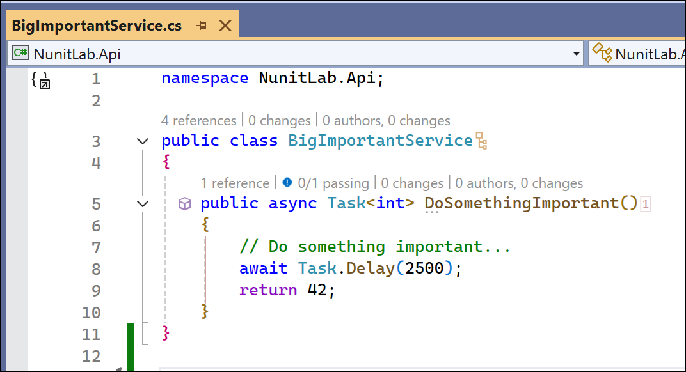
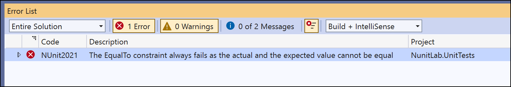
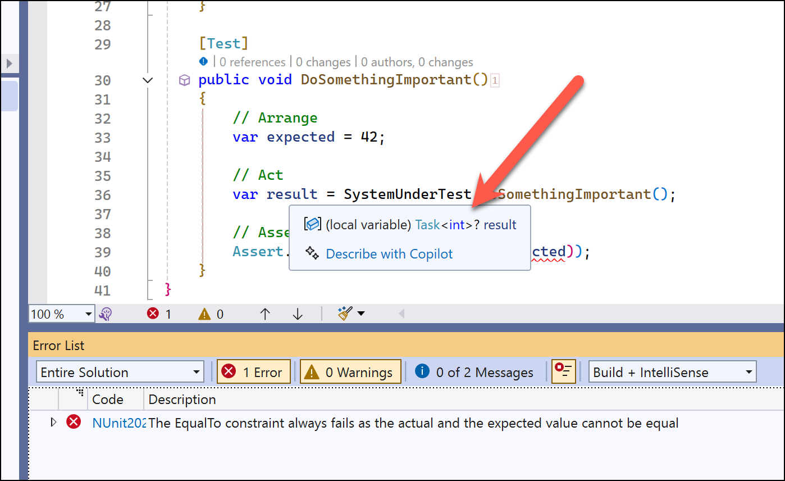
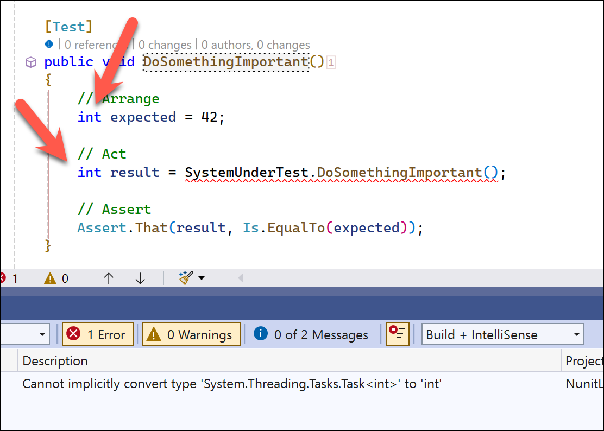
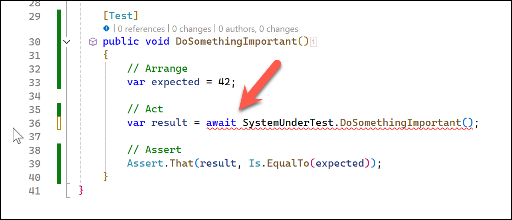
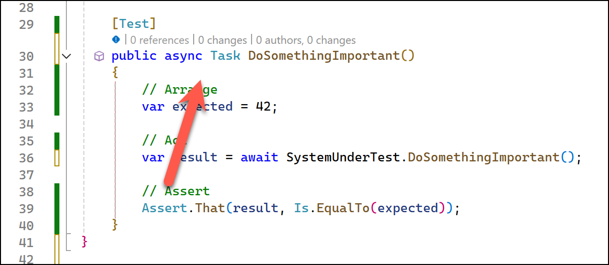
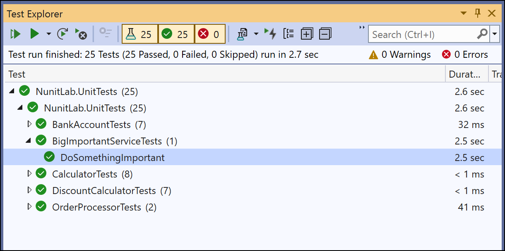

# Lab 6: Testing Asynchronous Code

## Objective
Learn how to write unit tests for asynchronous methods using NUnit and also notice, understand, and fix a common compiler problem in `async` code.

## Prerequisites
- Completion of **Lab 5** or familiarity with custom assertions.
- Basic understanding of asynchronous programming in C# (`async` and `await`).

## Instructions

### Step 1: Create an BigImportantService Class
1. In the `NunitLab.Api` project, create a new class `BigImportantService.cs`:
   ```csharp
   namespace NunitLab.Api;
   
   public class BigImportantService
   {
       public async Task<int> DoSomethingImportant()
       {
           // Do something important...
           await Task.Delay(2500);
           return 42;
       }
   }
   ```



### Step 2: Write Unit Tests for BigImportantService
1. In the `NunitLab.UnitTests` project, create a new test class `BigImportantServiceTests.cs`
   

*NOTE: There's a deliberate compilation error in this code. I'll talk you through it in a moment. Please hold. Your course is very important to us.*   

   ```csharp
   using NunitLab.Api;
   
   namespace NunitLab.UnitTests;
   
   [TestFixture]
   public class BigImportantServiceTests
   {
       public BigImportantService? _systemUnderTest;
   
       [SetUp]
       public void Setup()
       {
           _systemUnderTest = new BigImportantService();
       }
   
       public BigImportantService SystemUnderTest
       {
           get
           {
               if (_systemUnderTest == null)
               {
                   _systemUnderTest = new BigImportantService();
               }
   
               return _systemUnderTest;
           }
       }
   
       [Test]
       public void DoSomethingImportant()
       {
           // Arrange
           var expected = 42;
   
           // Act
           var result = SystemUnderTest.DoSomethingImportant();
   
           // Assert
           Assert.That(result, Is.EqualTo(expected));
       }
   }
   ```

### Step 3: Try to Compile...and then try to figure out why it breaks

Ok. About that deliberate compile error...

1. Try to compile the code

2. The code won't compile



Now why did I add this compile error?  Because I personally do this 20+ times a week in my own code and I don't want you to burn any more energy than you have to handling it or getting frustrated by it.  

This code `var result = SystemUnderTest.DoSomethingImportant();` looks so entirely normal and uninteresting.  And yet, when we get to the Assert -- `var result = SystemUnderTest.DoSomethingImportant();` -- it's failing with a completely bizarre error message: **The EqualTo constraint always fails as the actual and the expected value cannot be equal**.

The problem is hidden a little bit by the `var result` variable declaration.  The C# `var` keyword means that the variable is declared as whatever the compiler detects that it should be. I know that when I'm writing code and look at this I'd probably be thinking that `SomethingImportant()` returns an `int`.  And it does...

...sort of.

Since `SomethingImportant()` is an `async` method, it doesn't return `int` it returns `Task<int>`.  The compiler is more than happy to make `var result` the right variable type.  To the compiler, **Line 36** makes perfect sense.  But when it hits **Line 39** - `Assert.That(result, Is.EqualTo(expected));`- the compiler tosses out an error.



If we wrote the code like the following screenshot, we'd still get a compile error but it would make a lot more sense.  **Cannot implicitly convert type 'System.Threading.Tasks.Task<int>' to 'int'**



This is all **var's** fault.  (Not really.)

### Step 4: Fix the Compile Error

It's not really `var` that's causing the problem.  The var keyword is simply shifting where the point where we actually notice the error.  

**The real problem:** we're missing the `await` keyword.

1. Add the `await` keyword before the call to **SystemUnderTest.DoSomethingImportant()**



2. Recompile.
3. You'll get a new compile error.  **The 'await' operator can only be used within an async method. Consider marking this method with the 'async' modifier and changing its return type to 'Task'.**

This is happening because we're trying to use `await` inside a method that isn't marked as `async`.

4. Modify the method to use `async`. To do this, change the method signature to be `public async Task DoSomethingImportant()`

```csharp
[Test]
public async Task DoSomethingImportant()
{
    // Arrange
    var expected = 42;

    // Act
    var result = await SystemUnderTest.DoSomethingImportant();

    // Assert
    Assert.That(result, Is.EqualTo(expected));
}
```




5. Try to compile.

This time the compile should succeed.

### Step 5: Run the Tests
1. Open the **Test Explorer** in Visual Studio.
2. Run all tests
3. The tests should pass




---
