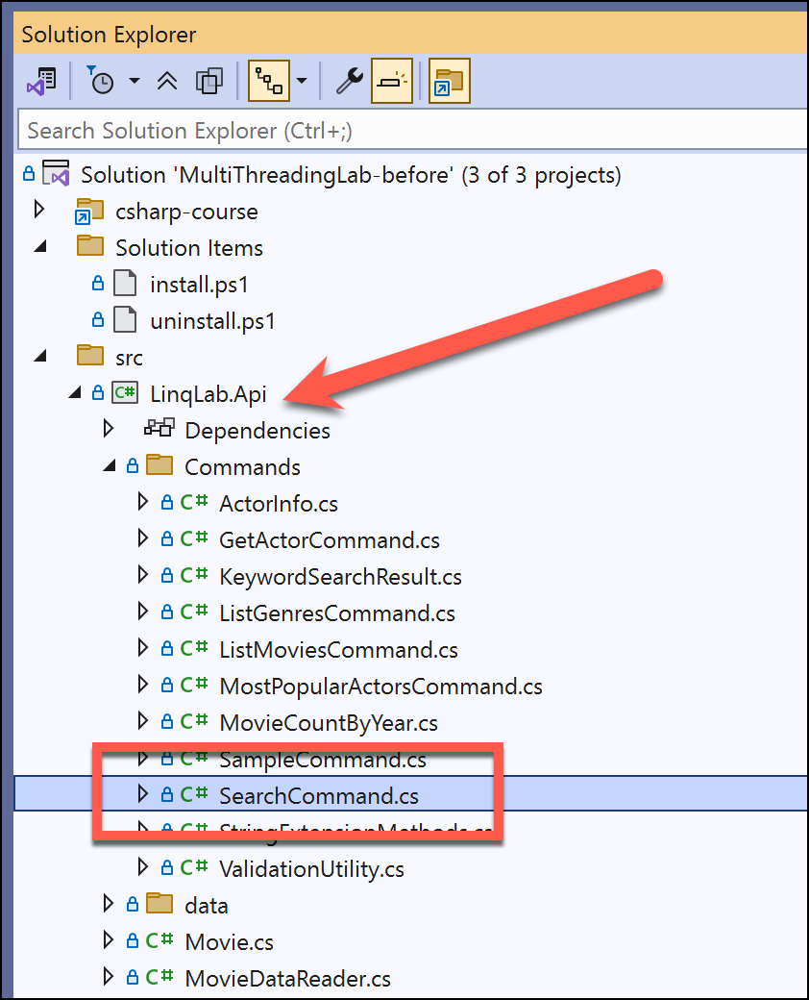
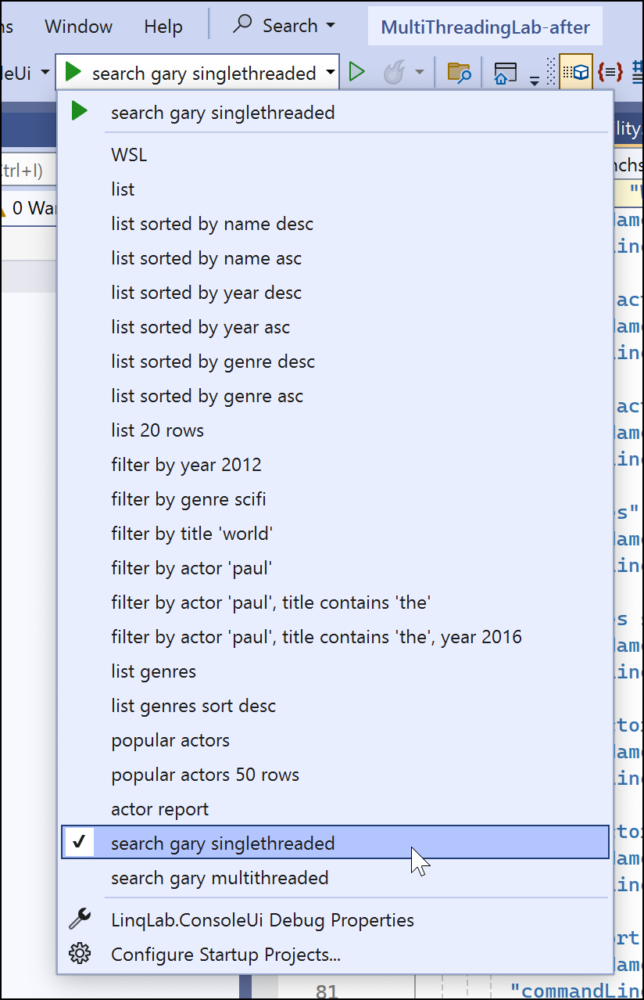
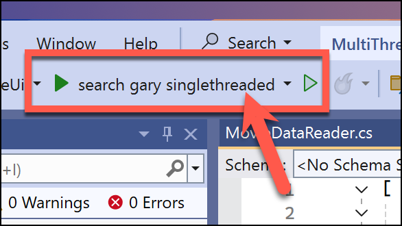
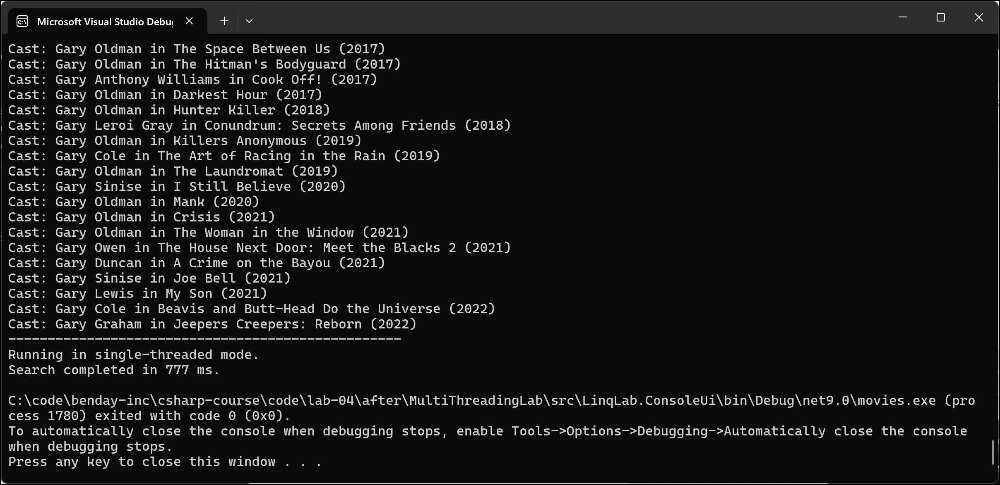
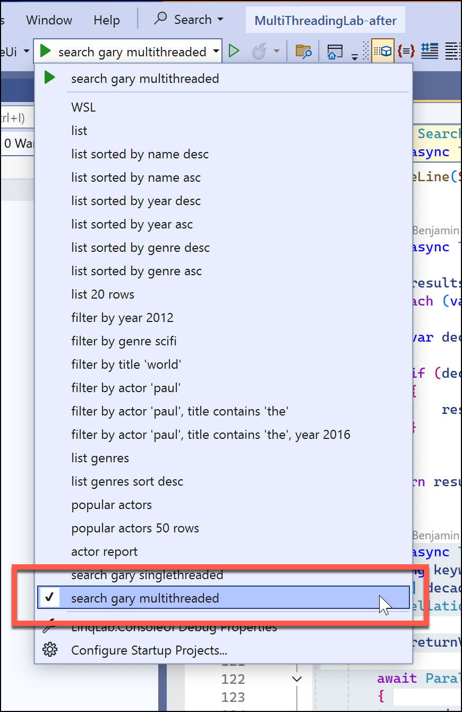
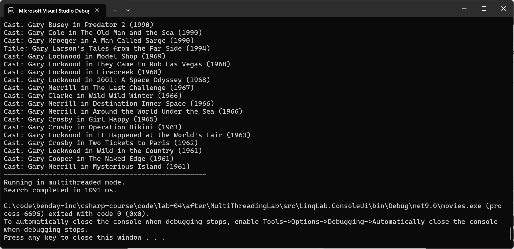
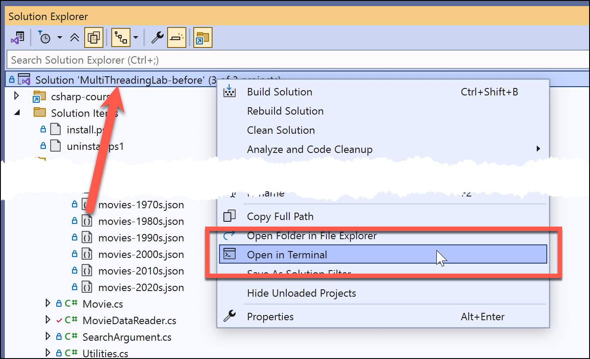
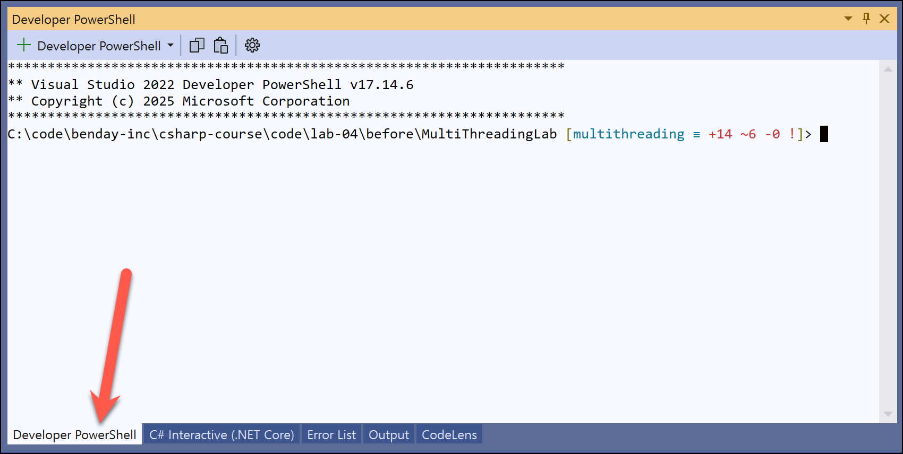
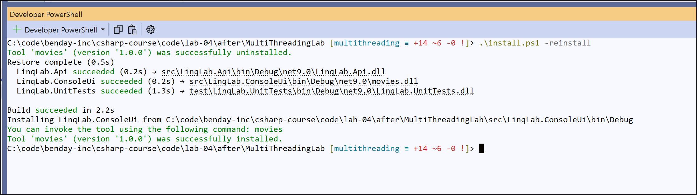

# Hands-On Lab: Search using Parallel.ForEach

## Overview

In this lab, uses code from the LINQ lab and has you implement a new keyword search feature.  You'll start by adding a single-threaded version of the movie/actor search and collect some basic timing information. Then you'll implement a multithreaded version that uses Parallel.ForEach().

---

## Prerequisites

- Basic understanding of C# and .NET.
- Familiarity with `Task`, `async`, and `await`.
- Visual Studio or a similar IDE.

---

## Objectives

By the end of this lab, you will:
1. Reinforce your knowledge of LINQ for querying data.
2. Simple profiling of an operation using `Stopwatch`.
3. Implement a multi-threaded application using `Task` and `Parallel.ForEach`.

---

## Step 0: Open the Solution & Find the SearchCommand code

The first step will be to find the starting version of the solution code.  It should be in the `code\lab-04-01\before` folder from the Git repository.

* Open the **MultiThreadingLab-before.sln** file in Visual Studio

In **Solution Explorer**, open the `src/LinqLab.Api/Commands` folder and locate the **SearchCommand.cs** file.  It should look similar to the screenshot below.



All the work in this lab is going to happen in this file.

* Open **SearchCommand.cs**

This class is the beginning of the keyword search functionality that will run from the command line. The `GetArguments()` method configures this command to accept two arguments on the command line: keyword and multithreaded.

Keyword is the search value.  Multithreaded indicates whether the search will run as single-threaded or multi-threaded.  The default will be single-threaded.

```csharp
public override ArgumentCollection GetArguments()
{
    var args = new ArgumentCollection();

    args.AddString("keyword")
        .AsRequired()
        .WithDescription(
            "Keyword to search for.")
        .FromPositionalArgument(1);

    args.AddBoolean("multithreaded")
        .AsNotRequired()
        .AllowEmptyValue()
        .WithDescription("Run multithreaded search. defaults to false.")
        .WithDefaultValue(false);

    return args;
}
```

At the bottom of this file, you'll see a method called `SearchAsync()`.  This is where you'll add the logic for this lab.

```csharp
private Task SearchAsync(string keyword, bool multithreaded)
{
    throw new NotImplementedException();
}
```


## Step 1: Single-threaded Search Implementation

Let's implement the keyword search in a simple, single-threaded way.  One of the things we'll do is to use `System.Diagnostics.Stopwatch` to time how long it takes to run a search in single-threaded versus multithreaded mode.

* Add the following implementation of the `SearchAsync()` method

```csharp
private async Task SearchAsync(string keyword, bool multithreaded)
{
    var stopwatch = System.Diagnostics.Stopwatch.StartNew();

    var decades = new int[] { 1900, 1910, 1920, 1930, 1940, 1950, 1960, 1970, 1980, 1990, 2000, 2010, 2020 };

    IEnumerable<KeywordSearchResult> results;

    if (multithreaded == false)
    {
        results = await SearchSingleThreaded(keyword, decades);
    }
    else
    {
        results = await SearchParallelAsync(keyword, decades);
    }

    stopwatch.Stop();

    if (results.Any() == false)
    {
        WriteLine("No results found.");
    }
    else
    {
        WriteLine($"Found {results.Count()} results for keyword '{keyword}':");
        WriteLine("--------------------------------------------------");

        foreach (var result in results)
        {
            WriteLine($"{result.MatchType}: {result.MatchDescription} ({result.Movie.Year})");
        }
    }

    WriteLine("--------------------------------------------------");

    if (multithreaded == true)
    {
        WriteLine("Running in multithreaded mode.");
    }
    else
    {
        WriteLine("Running in single-threaded mode.");
    }

    WriteLine($"Search completed in {stopwatch.ElapsedMilliseconds} ms.");
}
```


For right now, just add an implementation of the multithreaded search that compiles but doesn't do anything.

* Add the `SearchParallelAsync()` implementation 

```csharp
private async Task<IEnumerable<KeywordSearchResult>> SearchParallelAsync(
    string keyword,
    int[] decades,
    CancellationToken token = default)
{
    return new ConcurrentBag<KeywordSearchResult>();
}
```

## Step 2: Implement the Search

We're going to use the exact same code for the single-threaded and multi-threaded search. We're just going to call it in a different way.  

* Enter the code implementation for `SearchAsync()`

```csharp
private async Task<List<KeywordSearchResult>> SearchAsync(string keyword, int decade)
{
    var sortDescending = Arguments.GetBooleanValue("desc");

    var reader = new MovieDataReader();

    var movies = reader.GetMovies(decade);

    var results = new List<KeywordSearchResult>();

    var matchingMovies = movies
        .Where(m => m.Title.Contains(keyword, StringComparison.OrdinalIgnoreCase))
        .ToList();

    foreach (var movie in matchingMovies)
    {
        var result = new KeywordSearchResult
        {
            MatchType = "Title",
            MatchDescription = movie.Title,
            Movie = movie
        };

        var isValid = await ValidationUtility.ValidateResult(result);

        if (isValid == false)
        {
            continue; // Skip this result if validation fails
        }

        results.Add(result);            
    }

    var matchingMoviesByCast = movies
        .Where(m => m.Cast.Any(c => c.Contains(keyword, StringComparison.OrdinalIgnoreCase)))
        .ToList();

    foreach (var movie in matchingMoviesByCast)
    {
        var matchingCast = movie.Cast
            .Where(c => c.Contains(keyword, StringComparison.OrdinalIgnoreCase))
            .ToList();

        foreach (var castMember in matchingCast)
        {
            results.Add(new KeywordSearchResult
            {
                MatchType = "Cast",
                MatchDescription = $"{castMember} in {movie.Title}",
                Movie = movie
            });
        }
    }

    return results;
}
```

## Step 3: Implement `SearchSingleThreaded()`

The movie data is stored in individual files by decade. These files are in the `data` folder in the `LinqLab.Api` project. While the `SearchAsync()` method does all the actual LINQ query work for searching the data in a decade, the `SearchSingleThreaded()` method is responsible for running the queries for each decade.  

* Add the `SearchSingleThreaded()` implementation as shown below

```csharp
private async Task<IEnumerable<KeywordSearchResult>> SearchSingleThreaded(string keyword, int[] decades)
{
    var results = new List<KeywordSearchResult>();
    foreach (var decade in decades)
    {
        var decadeResult = await SearchAsync(keyword, decade);

        if (decadeResult.Count > 0)
        {
            results.AddRange(decadeResult);
        }
    }

    return results;
}
```

At this point the application should compile.

* Compile the solution and fix any build errors


## Step 4: Run the Application

Now that you have an app that's compiling, you can run it in the debugger.  

* From the **launch settings** button menu, select **search gary singlethreaded**.



* Click the debug button to launch the application



You should see a result that looks something like the screenshot below.



* Make a note of the number of milliseconds reported by **Search completed in *X* ms** 

## Step 5: Implement the multi-threaded version

Next, let's implement the multi-threaded version of the search. Two big things that you'll notice in this implementation are 

1. The use of `await Parallel.ForEachAsync()`
2. The collection is now using `ConcurrentBag<T>` instead of `List<T>`

The [`Parallel.ForEachAsync()`](https://learn.microsoft.com/en-us/dotnet/api/system.threading.tasks.parallel.foreachasync?view=net-9.0) method takes care of running all the individual decade-based searches in a multithreaded way.  When all the individual searches are completed, then the method exits. 

`ConcurrentBag<T>` is designed for multiple threads to add items simultaneously without explicit locks, so each iteration inside Parallel.ForEachAsync can drop its results into the bag safely and cheaply. A regular `List<T>` isn’t thread-safe and concurrent writes could/would corrupt its internal array.  You could still use `List<T>` but in order to make it work reliably, you’d have to wrap every Add in a lock, introducing contention that can erase much of the parallel speed-up.

`ConfigureAwait(false)` tells each awaited SearchAsync call **not to recapture the caller’s synchronization context** (UI thread, ASP.NET request context, etc.). Because the loop body is already running on a thread-pool thread inside Parallel.ForEachAsync, there’s no need to hop back to whatever context happened to schedule the loop. Skipping that capture removes a bit of overhead and avoids the risk of deadlocks if someone later invokes this method from a single-threaded context.


* Add the following method implementation

```csharp
private async Task<IEnumerable<KeywordSearchResult>> SearchParallelAsync(
    string keyword,
    int[] decades,
    CancellationToken token = default)
{
    var returnValues = new ConcurrentBag<KeywordSearchResult>();

    await Parallel.ForEachAsync(decades, token, async (decade, token) =>
    {
        var decadeResult = await SearchAsync(keyword, decade).ConfigureAwait(false);

        foreach (var match in decadeResult)
        {
            returnValues.Add(match);
        }
    });

    return returnValues;
}
```


* Change the debug configuration to use `search gary multithreaded`



* Run the application



* Make a note of the number of milliseconds reported by **Search completed in *X* ms** 

### It's SLOWER???

It's entirely possible that this version of the code is even SLOWER than the single-threaded version.  How could this be possible?  Well, the way that the code just got run is using the Visual Studio debugger.  When the debugger is attached to the application, all kinds of weird stuff could happen.  And when you get into multi-threaded debugging -- well, visual studio gives you tools and does stuff to help make multithreaded debugging less painful.  But those features often come with a performance penalty.

***Pro Tip: Don't Try to Do Multi-threaded Performance Optimization using the Debugger***

Now before you undo your changes and decide to stay in single-threaded code forever, let's try running the application **without** using the debugger.

## Run the Application from the Command Line

Let's open up the **Developer PowerShell** tab in Visual Studio.

* In **Solution Explorer**, right-click on the **solution** node
* From the context menu, choose **Open in Terminal**




You should see a tab in Visual Studio that looks something like the screenshot below.



* Type the following command into the Developer PowerShell window:
  `.\install.ps1 -reinstall`
* Run the command

That command should re-install the command line version of the application. You should see something similar to the screenshot below saying something like `Tool 'movies' was successfully installed`.



Now that this is installed, try running the search in single-threaded and multi-threaded mode.

* Type `movies search gary` to run in single-threaded mode
* Type `movies search gary /multithreaded` to run in multi-threaded mode
* Try running some other search in single and multi thread mode

Is the performance better?

## Summary

In this lab you built a complete, timing-aware movie keyword search tool, beginning with a straightforward single-threaded implementation and then refactoring it to a parallel version that harnesses Parallel.ForEachAsync, a thread-safe ConcurrentBag<T> for result aggregation, and ConfigureAwait(false) for efficient continuations. By recording execution times in both modes and running the release build from the command line, you saw firsthand how debugger overhead skews benchmarks and how true parallelism can accelerate CPU-bound workloads when measured correctly.


