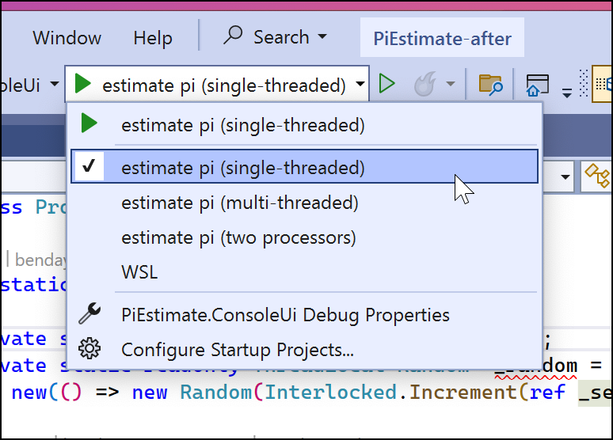
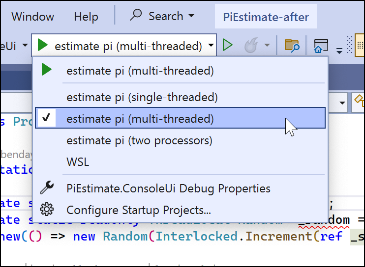
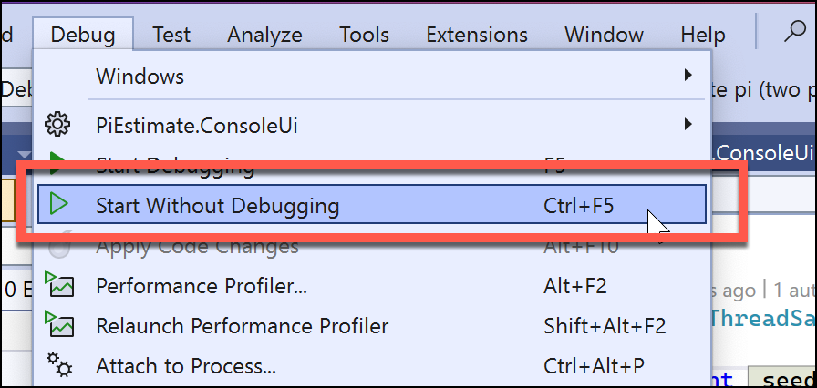
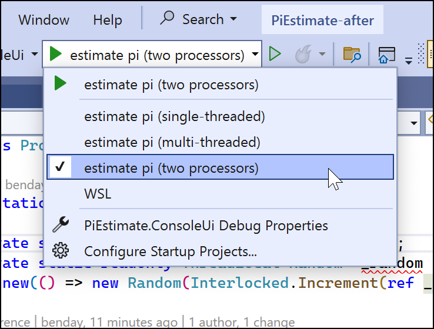

# TPL Lab: Monte‑Carlo π Estimator

## Overview

In this lab students will use the **Task Parallel Library (TPL)** to accelerate a Monte‑Carlo estimation of π.  They will begin with a sequential implementation, refactor it to run on all CPU cores with `Parallel.For`, experiment with **tuning the degree of parallelism**, and then add cancellation and progress reporting.  The exercise takes **45–60 minutes** for the core parts, with optional stretch goals for deeper exploration.

## Learning Objectives

- Distinguish CPU‑bound from I/O‑bound workloads
- Use `Parallel.For` with **thread‑local state** and **reduction**
- Generate thread‑safe random numbers
- Tune  and measure scalability
- Implement cancellation with `CancellationToken`
- (Optional) Report progress using `IProgress<T>`

---

## Prerequisites

- .NET 6 or later SDK installed
- Basic knowledge of C# and `async`/`await`

---

## Intro: "Embarrassingly Parallel"

There is a category of problem that is semi-colloquially known as "embarrassingly parallel".  Sometimes also said as "pleasantly parallel".  

**“Embarrassingly parallel”** describes workloads that can be broken into completely independent pieces, solved at the same time on separate cores or machines, and then combined with trivial effort. There are **no data dependencies, shared state, or ordering constraints** between those pieces, so you don’t need locks, complex coordination, or sophisticated algorithms to gain speed-up—just divide, run, and merge. Because each sub-task does identical work and finishes at roughly the same pace, scaling is close to linear until you hit hardware limits like core count, memory bandwidth, or I/O.

Classic examples—besides the Monte-Carlo π estimator—include:

- **Image-processing farms**: resizing or watermarking thousands of photos where each file is processed in isolation.
- **Brute-force password or key searches**: hashing different candidate strings in parallel.
- **Parameter sweeps or grid searches** in machine-learning hyper-parameter tuning.

All of these tasks fit the same pattern: give every worker its own chunk, let it run without talking to anyone else, and finally gather simple numeric or file-based results.

## Estimating Pi (**π**)

You can estimate Pi by doing this embarrassingly parallel experiment.  Draw a square. Then draw the biggest circle that you can inside of that square.

Now, start throwing darts at this diagram.  Whether the dart lands inside of the circle or outside of the circle is going to be
pretty random.  You might even say almost entirely random.  

If you calculate the number of darts thrown inside the circle vs. the number of darts thrown outside of the circle, you can actually estimate Pi.

The idea with monte carlo simulations is that you do lots and lots and lots and lots of simulations of randomness, and then out of that randomness, 
you can start to extract some truth about the real world.  

In this case, you're going to throw 10 million virtual darts at this board and using that, you'll estimate Pi.

The calculation is four times the "number of points inside the circle" divided by "total number of darts".  That number is your estimation of Pi.

## Part 0: Starting Code

The code for this lab is in the `lab-04-02` folder.  To start working on this, open the `PiEstimate-before.sln` solution in Visual Studio.

In the `PiEstimate.ConsoleUi` project, you'll see a file named `Program.cs`.  This is where you'll do most -- if not all -- of your coding for this lab.  It should look something like this:

```csharp
using System;
using System.Diagnostics;

class Program
{
    static void Main(string[] args)
    {
        
    }

    static double EstimatePiSequential(int iterations)
    {
        throw new NotImplementedException();
    }
}
```


## Part 1 — Baseline Sequential, Single-Threaded Measurement

### Tasks

* Run the provided `EstimatePiSequential` method with **10 million** samples.  Enter the code for `Main(string[] args)`:

```csharp
static void Main(string[] args)
{
    if (args.Contains("/multithreaded") == true)
    {
        Console.WriteLine("Multithreaded mode is not implemented in this example.");
        return;
    }
    else
    {

        // Default to 10 million samples unless overridden by first CLI arg
        int iterations = args.Length > 0 && int.TryParse(args[0], out var n)
                        ? n
                        : 10_000_000;

        Console.WriteLine($"Samples : {iterations:N0}");

        var stopwatch = Stopwatch.StartNew();
        var estimate = EstimatePiSequential(iterations);
        stopwatch.Stop();

        Console.WriteLine($"π ≈ {estimate:F6}");
        Console.WriteLine($"Elapsed                : {stopwatch.Elapsed.TotalSeconds:F2} s");
        Console.WriteLine($"Guess Error from Actual: {Math.Abs(Math.PI - estimate):F6}");
    }
}
```


* Enter the `EstimatePiSequential()` method code as shown below: 

```csharp
static double EstimatePiSequential(int iterations)
{
    var rand = new Random();
    int inside = 0;

    for (int i = 0; i < iterations; i++)
    {
        double x = rand.NextDouble();
        double y = rand.NextDouble();
        if (x * x + y * y <= 1) inside++;
    }

    return 4.0 * inside / iterations;
}
```

When you run the application, you should see an output that is something like the following.

* Try running the application using the `Estimate Pi (single-threaded)` option



#### Example Output

```
Samples : 10000000
π ≈ 3.141592
Elapsed: 1.23 s
Error   : 0.000001
```

* Note the elapsed time for the single-threaded version

---

## Part 2 — `Parallel.For` with Thread‑Local State

### Tasks

1. Replace the `for` loop with `Parallel.For` by adding the following method

```csharp
static double EstimatePiParallel(int iterations, int degree)
{
    int insideGlobal = 0;

    var opts = new ParallelOptions
    {
        MaxDegreeOfParallelism = degree
    };

    // Parallel.For with thread-local counters
    Parallel.For(0, iterations, opts,
        () => 0,                               // thread-local init
        (i, state, localInside) =>             // loop body
        {
            var rand = ThreadSafeRandom.ThisThreadsRandom;
            double x = rand.NextDouble() * 2.0 - 1.0;
            double y = rand.NextDouble() * 2.0 - 1.0;
            if (x * x + y * y <= 1.0)
                localInside++;
            return localInside;                // pass updated local value forward
        },
        localInside =>                         // local finally
            Interlocked.Add(ref insideGlobal, localInside));

    return 4.0 * insideGlobal / iterations;
}
```

2. Modify the Main() method:

```csharp
static void Main(string[] args)
{
    // Default to 10 million samples
    int iterations = 10_000_000;
    Console.WriteLine($"Samples : {iterations:N0}");

    if (args.Contains("/multithreaded") == true)
    {
        var degree = GetDegreeOfParallelism(args, Environment.ProcessorCount);

        Console.WriteLine($"Processor Count: {Environment.ProcessorCount}");
        Console.WriteLine($"Parallelism: {degree} threads");

        var stopwatch = Stopwatch.StartNew();
        var estimate = EstimatePiParallel(iterations, degree);
        stopwatch.Stop();

        Console.WriteLine($"π ≈ {estimate:F6}");
        Console.WriteLine($"Elapsed                : {stopwatch.Elapsed.TotalSeconds:F2} s");
        Console.WriteLine($"Guess Error from Actual: {Math.Abs(Math.PI - estimate):F6}");
    }
    else
    {
        Console.WriteLine("Running in single-threaded mode.");

        var stopwatch = Stopwatch.StartNew();
        var estimate = EstimatePiSequential(iterations);
        stopwatch.Stop();

        Console.WriteLine($"π ≈ {estimate:F6}");
        Console.WriteLine($"Elapsed                : {stopwatch.Elapsed.TotalSeconds:F2} s");
        Console.WriteLine($"Guess Error from Actual: {Math.Abs(Math.PI - estimate):F6}");
    }
}
```

3. Add GetDegreeOfParallelism() method:

```csharp
static int GetDegreeOfParallelism(string[] args, int defaultValue)
{
    var arg = args.FirstOrDefault(a => a.StartsWith("/degree:", StringComparison.OrdinalIgnoreCase));
    if (arg != null && int.TryParse(arg.Split(':')[1], out int d) && d > 0)
        return d;
    return defaultValue;
}
```

4. Add EstimatePiParallel() method:

```csharp
 static double EstimatePiParallel(int iterations, int degree)
 {
     int insideGlobal = 0;

     var opts = new ParallelOptions
     {
         MaxDegreeOfParallelism = degree
     };

     // Parallel.For with thread-local counters
     Parallel.For(0, iterations, opts,
         () => 0,                               // thread-local init
         (i, state, localInside) =>             // loop body
         {
             var rand = ThreadSafeRandom.ThisThreadsRandom;
             double x = rand.NextDouble() * 2.0 - 1.0;
             double y = rand.NextDouble() * 2.0 - 1.0;
             if (x * x + y * y <= 1.0)
                 localInside++;
             return localInside;                // pass updated local value forward
         },
         localInside =>                         // local finally
             Interlocked.Add(ref insideGlobal, localInside));

     return 4.0 * insideGlobal / iterations;
 }
```

* Try running this using the `Estimate Pi (Multi-Threaded)` option in Visual Studio



#### Example Output

```
Samples : 10000000
π ≈ 3.141638
Elapsed: 0.35 s
Speed‑up: 3.5×
Error   : 0.000046
```

*Add a screenshot of the parallel run highlighting the speed‑up.*

---

## Part 3 — **Tuning Degree of Parallelism**

> *Goal:* Show how controlling the number of worker threads affects performance and CPU utilisation.

### Concept Recap

`Parallel.For` accepts a `ParallelOptions` object.  Setting `MaxDegreeOfParallelism` limits how many concurrent tasks it may schedule:

```csharp
var opts = new ParallelOptions { MaxDegreeOfParallelism = 4 }; // use 4 logical processors
```


### Reminder: Launching the Application without Debugging

Multi-threaded applications can behave VERY differently if the debugger is attached.  Remember that you can launch the app without debugging by going  to **Debug | Start Without Debugging** or pressing **CTRL-F5**.



### Try running with different Parallelism Settings

There are some additional options for running the application. 

* Try running the application using the `estimate pi (two processors)` option. Be sure to try this with and without the debugger being attached.



* Try creating other options for parallelism counts.  Be sure to try this with and without the debugger being attached.

### Tasks

1. Wrap the call from Part 2 in a method that takes `int maxDegree` and passes it via `ParallelOptions`.
2. **Experiment** with at least four values:
   - `1` (sequential fallback)
   - `Environment.ProcessorCount / 2`
   - `Environment.ProcessorCount`
   - `Environment.ProcessorCount × 2`
3. Record runtime for each setting in a small table and compute speed‑up versus sequential.
4. Observe CPU utilisation in Task Manager or `dotnet-counters`.

#### Example Table (fill in during lab)

| MaxDegreeOfParallelism | Elapsed (s) | Speed‑up | Utilisation Notes   |
| ---------------------- | ----------- | -------- | ------------------- |
| 1                      | 1.23        | 1.0×     | Single core \~100 % |
| 4                      | 0.46        | 2.7×     | 4 cores pegged      |
| 8                      | 0.31        | 4.0×     | 8 cores pegged      |
| 16                     | 0.32        | 3.8×     | Context‑switching   |

## Summary

By the end of this exercise you will have transformed a single‑threaded Monte‑Carlo π estimator into a highly parallel, performance‑tuned program that exploits every logical core on your machine. Along the way you practiced the TPL patterns that matter in real projects: creating **thread‑local state** to avoid contention, using `**Parallel.For**` with custom `ParallelOptions` to control scaling, and aggregating results safely with atomic operations. Timings taken outside the debugger let you quantify speed‑ups objectively and see the law of diminishing returns once you exceed the practical degree of parallelism for your hardware.

Perhaps most importantly, the lab shows what *embarrassingly parallel* really feels like in code: the computational core—testing whether a random point falls inside the unit circle—has no dependencies, so adding threads yields an almost linear drop in runtime until other resources become the bottleneck. You now have a template for analysing and parallelising any workload that shares those characteristics, from batch image processing to Monte‑Carlo risk simulations.
